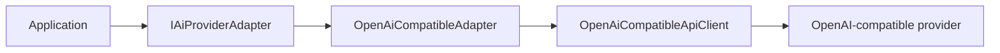
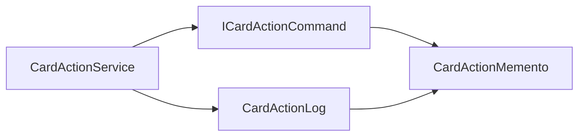

# LTWNC English

Ứng dụng web học từ vựng tiếng Anh bằng flashcard, xây dựng với ASP.NET Core MVC và Entity Framework Core. Người dùng có thể tạo bộ thẻ, nhập dữ liệu từ tệp, học theo nhiều chế độ, ôn tập ngắt quãng và luyện hội thoại với AI.

## Tính năng

- Đăng ký, đăng nhập và phân quyền bằng cookie authentication.
- Hồ sơ cá nhân/công khai, thống kê học tập, timeline và bảng xếp hạng.
- Tạo, chỉnh sửa, sao chép và chia sẻ bộ flashcard công khai hoặc riêng tư.
- Hỗ trợ thuật ngữ, định nghĩa, IPA, loại từ, ví dụ, từ đồng nghĩa và hình ảnh.
- Nhập thẻ từ CSV/XLSX, kiểm tra định dạng và báo lỗi theo từng dòng.
- Study Hub với Flashcard, Quiz, Dictation, English Mission và Review.
- Ôn tập ngắt quãng theo từng bộ thẻ, hạn mức thẻ mới và khoảng ôn tối đa.
- Thao tác hàng loạt xóa, đánh sao, bỏ sao và hoàn tác từ lịch sử.
- Thành tích, tiến độ học và thông báo sự kiện sau mỗi hoạt động.
- Quản trị người dùng, báo cáo nội dung, audit log và AI provider.
- AI provider tương thích OpenAI, hỗ trợ mã hóa API key, kiểm tra kết nối và fallback theo độ ưu tiên.

## Công nghệ

| Thành phần | Công nghệ |
| --- | --- |
| Backend | ASP.NET Core MVC, .NET 10 |
| ORM | Entity Framework Core 10 |
| Database | SQL Server |
| Giao diện | Razor Views, Bootstrap, CSS và JavaScript |
| Xác thực | Cookie authentication, ASP.NET Core PasswordHasher |
| AI | OpenAI-compatible HTTP API |
| Import | CsvHelper, ClosedXML |
| Xử lý ảnh | ImageSharp |
| Kiểm thử | xUnit, Moq, EF Core InMemory |

## Kiến trúc

Project tổ chức theo domain thay vì gom các implementation vào thư mục `Patterns`:

```text
ltwnc/
├── Areas/Admin/                 # Khu vực quản trị
├── Controllers/                # MVC controllers
├── Data/                        # AppDbContext
├── Models/
│   ├── Entities/               # Entity và domain state
│   ├── Enums/
│   └── ViewModels/
├── Services/
│   ├── Achievements/           # Thành tích và observer
│   ├── Ai/                     # Provider, router và adapter
│   ├── CardActions/            # Command, Memento, Factory Method
│   ├── FlashcardSets/          # CRUD, copy và import
│   ├── PublicLibrary/          # Thư viện công khai và cache decorator
│   ├── Review/                 # Spaced review và state machine
│   ├── Study/                  # Các dịch vụ học
│   ├── StudyEvents/            # Publisher và observer
│   └── StudyModes/             # Các strategy chế độ học
├── Views/                      # Razor Views
├── wwwroot/                    # CSS, JavaScript, ảnh và upload
├── Migrations/                 # EF Core migrations
├── explain/                    # Tài liệu giải thích design pattern
└── tests/ltwnc.Tests/          # Unit và integration tests
```

Controller phụ thuộc vào interface của application service. Dependency Injection trong `Program.cs` chịu trách nhiệm ghép implementation, decorator, strategy, observer và command creator.

## 9 mẫu thiết kế GoF

| Nhóm | Mẫu | Vị trí áp dụng |
| --- | --- | --- |
| Khởi tạo | Prototype | Sao chép bộ thẻ và flashcard |
| Khởi tạo | Factory Method | Tạo command theo loại thao tác |
| Cấu trúc | Adapter | Chuyển contract ứng dụng sang OpenAI-compatible API |
| Cấu trúc | Decorator | Bổ sung cache cho thư viện công khai |
| Hành vi | Strategy | Chọn cách lấy thẻ theo chế độ học |
| Hành vi | State | Xử lý lịch ôn theo giai đoạn ghi nhớ |
| Hành vi | Command | Đóng gói thao tác hàng loạt trên thẻ |
| Hành vi | Memento | Lưu trạng thái để hoàn tác command |
| Hành vi | Observer | Phát sự kiện học cho thành tích và logging |

### Prototype

`FlashcardSet` và `Flashcard` triển khai `IPrototype<T>`. `FlashcardSet.Clone()` tạo deep copy các thẻ, giữ nội dung học nhưng reset identity, owner, trạng thái công khai và dữ liệu cá nhân. `FlashcardSetService` gán owner mới trước khi lưu bản sao.

### Factory Method

`CardActionCommandCreator` định nghĩa Factory Method `CreateCommand()`. Các concrete creator `DeleteCardsCommandCreator`, `StarCardsCommandCreator` và `UnstarCardsCommandCreator` override method này để tạo đúng concrete command.

`CardActionCommandFactory` chỉ resolve creator theo `ActionType`; controller và service không chứa nhánh khởi tạo concrete product. Khi thêm loại command, chỉ cần thêm creator và đăng ký nó vào DI.

### Adapter

`IAiProviderAdapter` là Target mà application sử dụng. `OpenAiCompatibleAdapter` chuyển request, response, cấu hình và exception giữa contract nội bộ với `OpenAiCompatibleApiClient`.



### Decorator

`CachedPublicLibraryServiceDecorator` triển khai cùng contract `IPublicLibraryService`, bọc `PublicLibraryService` và bổ sung cache cho các truy vấn phổ biến. Truy vấn không đủ điều kiện cache vẫn được chuyển nguyên vẹn tới service gốc.

### Strategy

Mỗi chế độ học triển khai `IStudyModeStrategy`, ví dụ `FlashcardModeStrategy`, `DictationModeStrategy`, `QuizModeStrategy`, `EnglishMissionModeStrategy` và `ReviewModeStrategy`. `StudyModeStrategyResolver` chọn strategy từ tập implementation được đăng ký trong DI.

### State

`ReviewStateMachine` là Context. Bốn concrete state `NewReviewState`, `LearningReviewState`, `ReviewingReviewState` và `RelearningReviewState` xử lý rating và quyết định transition tiếp theo mà không đưa toàn bộ điều kiện nghiệp vụ vào `ReviewService`.

### Command

`DeleteCardsCommand`, `StarCardsCommand` và `UnstarCardsCommand` triển khai `ICardActionCommand`. `CardActionService` thực thi mọi command qua cùng một contract, ghi lịch sử và hỗ trợ Undo.

### Memento

Command chụp trạng thái trước khi thay đổi và trả về `CardActionMemento`. `CardActionService` đóng vai trò Caretaker, lưu memento trong `CardActionLog.SnapshotJson` và truyền lại cho command khi hoàn tác.



### Observer

`StudyEventPublisher` phát sự kiện tới các implementation của `IStudyEventObserver`. `AchievementStudyObserver` cập nhật thành tích, còn `LoggingStudyObserver` ghi log. Lỗi ở một observer được cô lập để không chặn observer khác hoặc làm hỏng buổi học đã lưu.

Các bài giải thích bổ sung về design pattern nằm trong [`explain/`](explain/README.md).

## Nhập flashcard

Tại `/Set/{id}/Edit`, chủ sở hữu có thể nhập tệp `.csv` hoặc `.xlsx` tối đa 10 MB. XLSX sử dụng worksheet đầu tiên.

Các cột bắt buộc, không phân biệt hoa thường:

- `Thuật ngữ`
- `Định nghĩa`
- `IPA`
- `Loại từ`
- `Ví dụ tiếng Anh`
- `Nghĩa ví dụ tiếng Việt`

Các cột tùy chọn là `Từ đồng nghĩa` và `URL ẢNH`.

```csv
Thuật ngữ,Định nghĩa,IPA,Loại từ,Ví dụ tiếng Anh,Nghĩa ví dụ tiếng Việt,Từ đồng nghĩa,URL ẢNH
```

## Cài đặt

Yêu cầu:

- .NET 10 SDK
- SQL Server, SQL Server Express hoặc LocalDB
- `dotnet-ef` nếu cần quản lý migration

```bash
git clone https://github.com/duchuyn04/LTWNC-English.git
cd LTWNC-English
cp appsettings.example.json appsettings.json
dotnet restore
```

Cấu hình connection string trong `appsettings.json` hoặc User Secrets:

```json
{
  "ConnectionStrings": {
    "DefaultConnection": "Server=localhost\\SQLEXPRESS;Database=LTWNC-English;Trusted_Connection=True;TrustServerCertificate=True;MultipleActiveResultSets=true"
  }
}
```

Tạo hoặc cập nhật database, sau đó chạy ứng dụng:

```bash
dotnet ef database update
dotnet run
```

## AI provider

Provider được quản lý tại `/Admin/AiProviders`. API key là tùy chọn và được mã hóa bằng ASP.NET Core Data Protection. Provider từ xa phải dùng HTTPS; HTTP chỉ được chấp nhận cho localhost hoặc loopback.

Để cấp quyền admin cho tài khoản đã đăng ký:

```sql
UPDATE AppUsers
SET IsAdmin = 1
WHERE NormalizedEmail = 'EMAIL@EXAMPLE.COM';
```

Đăng xuất và đăng nhập lại để cookie nhận claim admin mới.

## Thanh toán tín dụng qua SePay

English Mission sử dụng 1 tín dụng cho mỗi phản hồi AI được lưu thành công. Tạo mission không tốn tín dụng; lỗi AI và retry cùng mã lượt chat không bị trừ lại.

Có thể điền cấu hình SePay thật vào `appsettings.json` local; file này đã bị Git bỏ qua. `appsettings.example.json` chỉ chứa giá trị mẫu an toàn. Hoặc dùng User Secrets:

```bash
dotnet user-secrets set "SePay:Environment" "Sandbox"
dotnet user-secrets set "SePay:MerchantId" "MERCHANT_ID"
dotnet user-secrets set "SePay:SecretKey" "CHECKOUT_SECRET"
dotnet user-secrets set "SePay:IpnSecret" "IPN_SECRET"
dotnet user-secrets set "SePay:PublicBaseUrl" "https://your-public-domain.example"
```

Cấu hình IPN trên SePay trỏ tới `POST /api/payments/sepay/ipn`. Endpoint phải dùng HTTPS công khai; khi phát triển local có thể dùng tunnel HTTPS. Chỉ IPN `ORDER_PAID` hợp lệ mới cộng tín dụng, không cộng từ URL chuyển hướng của trình duyệt.

## Kiểm thử

Chạy toàn bộ test suite:

```bash
dotnet test tests/ltwnc.Tests/ltwnc.Tests.csproj
```

Build project:

```bash
dotnet build ltwnc.csproj
```

## License

Dự án học tập cho môn Lập trình Web Nâng cao.
