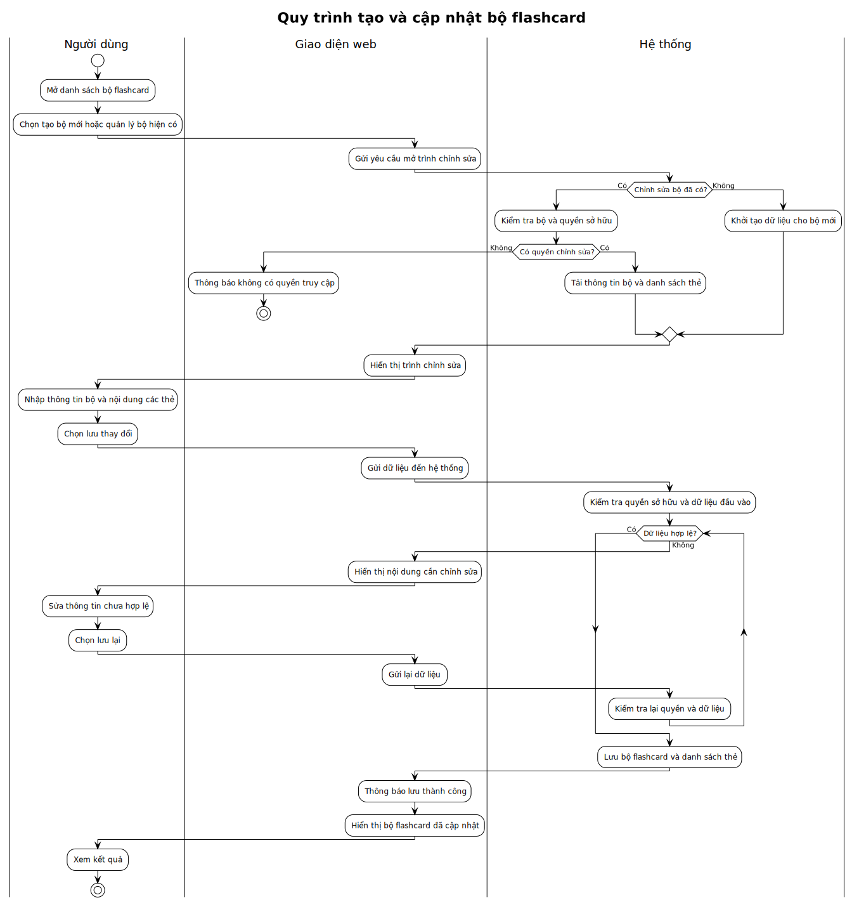
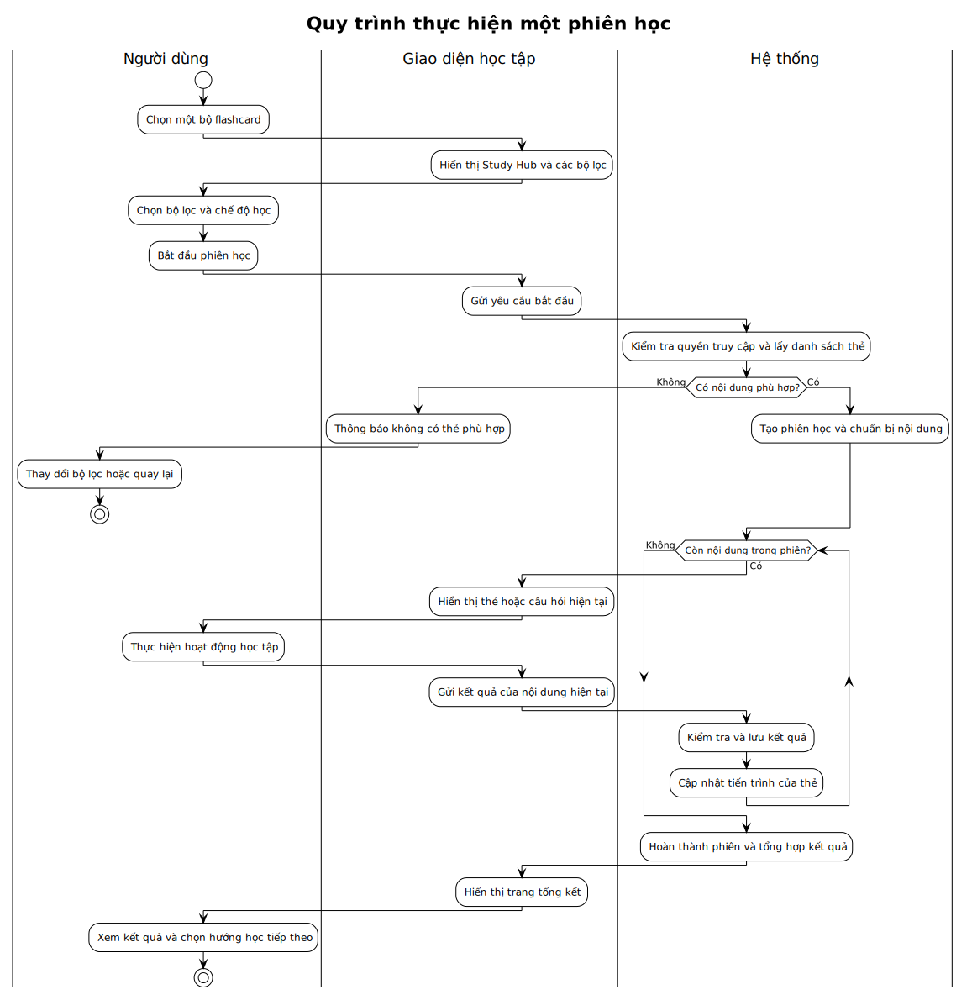
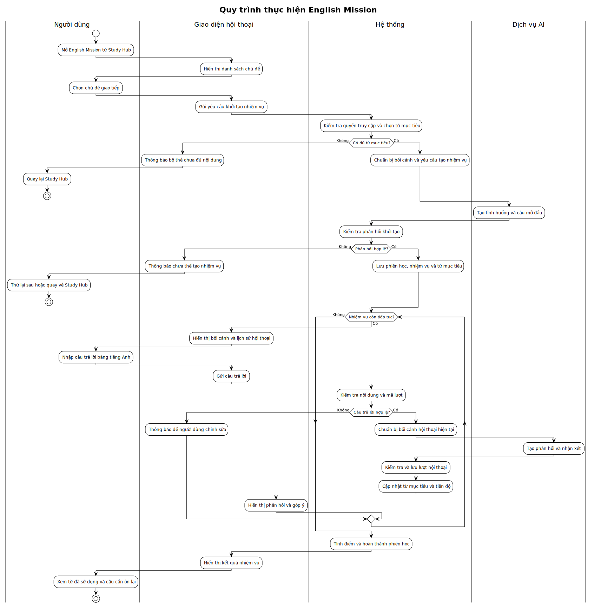

# Luồng xử lý của hệ thống LTWNC English

## Flow: Tạo và cập nhật bộ flashcard (Swimlane)

**Trigger**: Người dùng chọn tạo bộ mới hoặc quản lý một bộ flashcard hiện có.

**Related UC**: Quản lý bộ flashcard

> Nguồn PlantUML: `ltwnc-english-manage-flashcard-set-swimlane.puml`.

## Flow: Thực hiện một phiên học (Swimlane)

**Trigger**: Người dùng chọn một bộ flashcard và bắt đầu chế độ học.

**Related UC**: Thực hiện hoạt động học tập

> Nguồn PlantUML: `ltwnc-english-complete-study-session-swimlane.puml`.

## Flow: Thực hiện English Mission (Swimlane)

**Trigger**: Người dùng chọn English Mission và một chủ đề giao tiếp.

**Related UC**: Thực hiện hoạt động học tập

> Nguồn PlantUML: `ltwnc-english-english-mission-swimlane.puml`.
