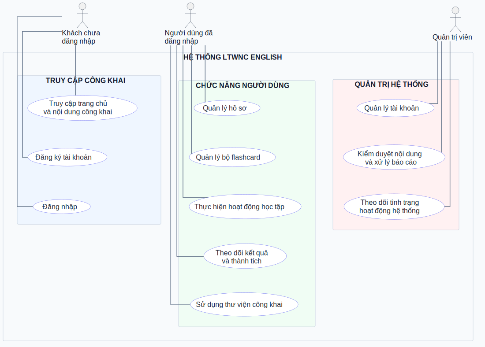

# LTWNC English Use Cases Index

## Use cases

| # | Slug | Level | Status | Actor primary | Covers FR | Screens | Errors | OQ ref | Priority | Updated |
|---|---|---|---|---|---|---|---|---|---|---|
| 1 | public-access | sea | draft | Khách chưa đăng nhập | Chưa đặc tả | Trang chủ, nội dung công khai | Chưa đặc tả | Không | P0 | 2026-07-21 |
| 2 | register | sea | draft | Khách chưa đăng nhập | Chưa đặc tả | Đăng ký | Chưa đặc tả | Không | P0 | 2026-07-21 |
| 3 | login | sea | draft | Khách chưa đăng nhập | Chưa đặc tả | Đăng nhập | Chưa đặc tả | Không | P0 | 2026-07-21 |
| 4 | manage-profile | sea | draft | Người dùng đã đăng nhập | Chưa đặc tả | Hồ sơ | Chưa đặc tả | Không | P1 | 2026-07-21 |
| 5 | manage-flashcard-sets | sea | draft | Người dùng đã đăng nhập | Chưa đặc tả | Bộ flashcard | Chưa đặc tả | Không | P0 | 2026-07-21 |
| 6 | study | sea | draft | Người dùng đã đăng nhập | Chưa đặc tả | Khu vực học tập | Chưa đặc tả | Không | P0 | 2026-07-21 |
| 7 | track-results | sea | draft | Người dùng đã đăng nhập | Chưa đặc tả | Kết quả, thành tích | Chưa đặc tả | Không | P1 | 2026-07-21 |
| 8 | public-library | sea | draft | Người dùng đã đăng nhập | Chưa đặc tả | Thư viện | Chưa đặc tả | Không | P1 | 2026-07-21 |
| 9 | manage-accounts | sea | draft | Quản trị viên | Chưa đặc tả | Quản lý tài khoản | Chưa đặc tả | Không | P0 | 2026-07-21 |
| 10 | moderate-content | sea | draft | Quản trị viên | Chưa đặc tả | Nội dung, báo cáo | Chưa đặc tả | Không | P0 | 2026-07-21 |
| 11 | monitor-system | sea | draft | Quản trị viên | Chưa đặc tả | Bảng điều khiển | Chưa đặc tả | Không | P1 | 2026-07-21 |

## Actors

| Actor | Loại | Mô tả | Nguồn |
|---|---|---|---|
| Khách chưa đăng nhập | primary | Truy cập trang chủ, đăng ký, đăng nhập và xem nội dung công khai | Mô tả phạm vi do người dùng cung cấp |
| Người dùng đã đăng nhập | primary | Quản lý dữ liệu cá nhân, sử dụng chức năng học tập và theo dõi kết quả | Mô tả phạm vi do người dùng cung cấp |
| Quản trị viên | secondary | Quản lý tài khoản, kiểm duyệt nội dung và theo dõi hệ thống | Mô tả phạm vi do người dùng cung cấp |

## Diagram

Nguồn của sơ đồ là `ltwnc-english-usecase-diagram.puml`. Tệp SVG được kết xuất từ PlantUML để sử dụng trong báo cáo.

## Relationships

Sơ đồ không sử dụng quan hệ include, extend hoặc generalization. Mỗi đường nối chỉ thể hiện sự tham gia trực tiếp của tác nhân vào ca sử dụng tương ứng.

## Nguồn dữ liệu

Nội dung sơ đồ được tổng hợp từ phạm vi tác nhân do người dùng cung cấp, README và các khu vực chức năng hiện có trong dự án.
