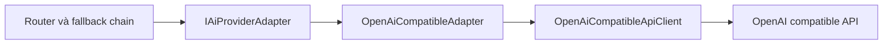

# Adapter, dịch giữa project và AI provider

## Chỉ cần nhớ một ý

Adapter giúp hai phần có cách nói khác nhau vẫn làm việc với nhau.

Nó nhận dữ liệu theo cách project hiểu, chuyển thành dữ liệu mà hệ thống bên ngoài hiểu, rồi chuyển kết quả trở lại.

Trong project này, Adapter đứng giữa ứng dụng và API tương thích OpenAI.

## Ví dụ dễ hiểu

Một ổ cắm điện Việt Nam và một phích cắm nước ngoài có hình dạng khác nhau. Bộ chuyển đổi nhận một đầu, đổi sang hình dạng phù hợp ở đầu kia.

Adapter AI cũng làm như vậy:

```text
Yêu cầu của project
        |
        v
OpenAiCompatibleAdapter
        |
        v
Request theo chuẩn OpenAI
```

## Trước khi Adapter được chuẩn hóa, code triển khai ra sao?

Nếu Router gọi thẳng `OpenAiCompatibleApiClient`, Router sẽ phải biết đồng thời:

- Cấu hình provider từ `appsettings.json`.
- Request ứng dụng `AiCompletionRequest`.
- JSON và endpoint của OpenAI.
- Cách phân loại lỗi cho ứng dụng.
- Cách gửi HTTP.

Khi đó logic fallback và logic giao thức bên ngoài bị trộn trong cùng một luồng.
Adapter tạo một ranh giới rõ: Router nói contract của application, còn client
nói HTTP OpenAI.

## Vì sao áp dụng Adapter đúng nghĩa cho chức năng này?

Ứng dụng không nên bắt `AiCompletionRouter` và các service học hiểu JSON của từng nhà cung cấp AI.

Project cần một contract ổn định:

```csharp
Task<string> CompleteAsync(
    AiProviderConnection connection,
    string? apiKey,
    AiCompletionRequest request,
    CancellationToken cancellationToken);
```

API OpenAI lại cần request có dạng:

```json
{
  "model": "model-id",
  "messages": [
    { "role": "system", "content": "..." },
    { "role": "user", "content": "..." }
  ],
  "max_tokens": 800,
  "temperature": 0.3
}
```

Hai bên không dùng cùng cấu trúc. Adapter là nơi phù hợp để dịch giữa chúng.

Provider Xiaomi-compatible dùng cùng request contract nhưng thay trường giới hạn token:

```json
{
  "model": "model-id",
  "messages": [
    { "role": "system", "content": "..." },
    { "role": "user", "content": "..." }
  ],
  "max_completion_tokens": 800,
  "temperature": 0.3
}
```

Hai trường `max_tokens` và `max_completion_tokens` là hai biến thể loại trừ nhau; Adapter chọn biến thể Xiaomi dựa trên host `xiaomimimo.com`.

Nếu sau này thêm một provider có giao thức khác, project có thể tạo adapter mới mà không đổi contract của Router.

## Adapter nằm ở đâu trong project?

| Vai trò GoF | Code |
| --- | --- |
| Client | [`AiCompletionRouter`](../Services/Ai/AiCompletionRouter.cs) |
| Target | [`IAiProviderAdapter`](../Services/Ai/AiProviderAdapterContracts.cs) |
| Adapter | [`OpenAiCompatibleAdapter`](../Services/Ai/OpenAiCompatibleAdapter.cs) |
| Adaptee | [`OpenAiCompatibleApiClient`](../Services/Ai/OpenAiCompatibleApiClient.cs) |
| Giao thức OpenAI | [`OpenAiContracts.cs`](../Services/Ai/OpenAiContracts.cs) |



## Từng vai trò làm gì?

### Client

`AiCompletionRouter` và `AiProviderFallbackHandler` chọn provider theo cấu hình,
xử lý fallback, timeout tổng và ghi log vận hành.

Các class này chỉ biết `IAiProviderAdapter`. Chúng không tạo JSON OpenAI.

### Target

`IAiProviderAdapter` là cách mà code trong project muốn gọi AI:

```csharp
string content = await adapter.CompleteAsync(
    connection,
    apiKey,
    request,
    cancellationToken);
```

### Adapter

`OpenAiCompatibleAdapter` chuyển request ứng dụng thành request OpenAI:

```csharp
var openAiRequest = new OpenAiChatRequest(
    connection.ModelId,
    [
        new OpenAiChatMessage("system", request.SystemPrompt),
        new OpenAiChatMessage("user", request.UserPrompt)
    ],
    request.MaxTokens,
    null,
    0.3m);
```

Nó cũng lấy nội dung từ response OpenAI và chuyển lỗi giao thức thành lỗi ứng dụng. Với Xiaomi-compatible, lời gọi tương đương truyền `null` cho `max_tokens` và `request.MaxTokens` cho `max_completion_tokens`.

### Adaptee

`OpenAiCompatibleApiClient` biết cách gọi endpoint `/chat/completions`.

Nó chịu trách nhiệm HTTP, DNS, timeout riêng của provider, HTTPS, chặn địa chỉ mạng nội bộ và đọc JSON theo giao thức OpenAI. `AiProviders:AllowPrivateNetworks` mặc định là `false`; chỉ bật opt-in trong môi trường development đáng tin cậy khi provider chạy ở localhost/private network.

## Một request đi qua hệ thống như thế nào?

```text
English Mission cần câu trả lời AI
              |
              v
AiCompletionRouter chọn provider
              |
              v
Adapter tạo OpenAiChatRequest
              |
              v
ApiClient gửi HTTP
              |
              v
Adapter lấy choices[0].message.content
              |
              v
Router trả nội dung cho English Mission
```

## Vì sao Adapter không nhận entity EF?

Target dùng `AiProviderConnection`, chỉ chứa dữ liệu runtime cần thiết:

```csharp
public sealed record AiProviderConnection(
    string Name,
    string BaseUrl,
    string ModelId,
    int TimeoutSeconds);
```

Nếu Adapter nhận trực tiếp object options đầy đủ hoặc JSON cấu hình, ranh giới AI
sẽ phụ thuộc vào cách lưu cấu hình của project. `AiProviderConnection` giữ
contract runtime nhỏ và ổn định dù cấu hình chuyển từ database sang
`appsettings.json`.

`AiProviderFallbackHandler` chuyển `AiProviderOptions` thành
`AiProviderConnection` trước khi gọi Adapter.

## Vì sao API key được truyền riêng?

API key không nằm trong `AiProviderConnection`. Handler đọc key từ options và
truyền bằng tham số riêng ngay trước lời gọi Adapter.

Cách này giữ secret ngoài:

- `AiProviderConnection` và các log runtime.
- Request JSON nội bộ của Adapter.
- Các object chỉ cần đọc cấu hình kết nối.

## Adapter chuyển lỗi ra sao?

Adaptee có lỗi riêng là `OpenAiClientException`.

Adapter chuyển lỗi đó thành lỗi mà ứng dụng hiểu:

```text
Lỗi cấu hình OpenAI -> AiProviderConfigurationException
Lỗi tạm thời OpenAI -> AiProviderUnavailableException
```

Router dựa vào loại lỗi ứng dụng để quyết định có thử provider tiếp theo hay không.

## Kiểm thử

Adapter được kiểm thử qua HTTP boundary giả lập, không gọi provider thật: [`OpenAiCompatibleAdapterTests.cs`](../tests/ltwnc.Tests/Services/Ai/OpenAiCompatibleAdapterTests.cs). Các case bao phủ request thường, hai biến thể giới hạn token, response thiếu/rỗng, lỗi JSON, lỗi cấu hình, kết nối, timeout và chính sách private-network opt-in.

## Tự kiểm tra

1. Router có cần biết trường `messages` trong JSON OpenAI không?
2. Class nào gửi HTTP thật sự?
3. Class nào dịch response OpenAI thành chuỗi nội dung cho project?

Đáp án:

1. Không. Adapter chịu trách nhiệm đó.
2. `OpenAiCompatibleApiClient`.
3. `OpenAiCompatibleAdapter`.

## Kết luận ngắn

Adapter là người phiên dịch giữa contract của project và giao thức OpenAI. Router nói ngôn ngữ của ứng dụng, API client nói ngôn ngữ HTTP OpenAI, còn Adapter chuyển đổi ở giữa.
