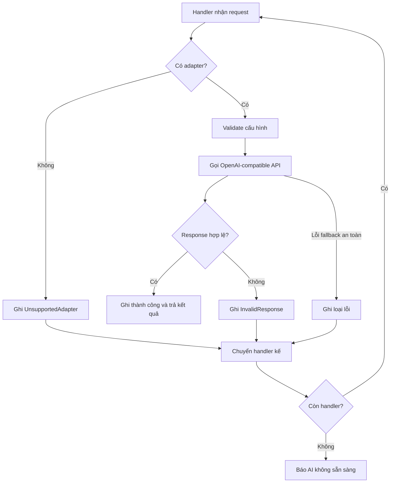

# Chain of Responsibility, thử lần lượt các provider AI

## Chỉ cần nhớ một ý

Chain of Responsibility tạo một chuỗi object xử lý cùng một request. Mỗi object
có thể xử lý request hoặc chuyển nó cho object kế tiếp.

Trong project này, mỗi provider AI là một mắt xích. Provider chính được thử
trước; nếu gặp lỗi an toàn cho fallback thì request đi tiếp tới provider kế:

```text
AiCompletionRouter
        |
        v
Primary provider handler
        |
        v
Backup provider handler
        |
        v
Provider cuối
```

Router không cần chứa một khối `if` riêng cho từng provider.

## Ví dụ dễ hiểu

Hãy hình dung một đường dây hỗ trợ:

1. Nhân viên đầu tiên nhận yêu cầu.
2. Nếu xử lý được, họ trả lời ngay.
3. Nếu vấn đề thuộc loại họ không xử lý được, họ chuyển sang người tiếp theo.
4. Nếu tất cả đều không xử lý được, đường dây báo không sẵn sàng.

Mỗi nhân viên là một handler. Người chuyển tiếp yêu cầu chính là liên kết
`Next` trong chain.

## Trước khi áp dụng Chain of Responsibility, code sẽ ra sao?

Router có thể tự giữ toàn bộ vòng lặp fallback:

```csharp
foreach (AiProvider provider in providers)
{
    try
    {
        return await TryCompleteWithProviderAsync(provider);
    }
    catch (AiProviderUnavailableException)
    {
        // Thử provider kế tiếp.
    }
}
```

Cách này vẫn chạy được, nhưng router phải biết chi tiết của từng lần thử:
validate cấu hình, gọi adapter, kiểm tra response, ghi log, xử lý timeout và
quyết định có chuyển tiếp hay không.

Khi quy tắc thử provider tăng lên, method router sẽ tiếp tục phình to.

## Vì sao chọn Chain of Responsibility?

Các provider đều nhận cùng một request và có cùng cơ hội xử lý. Một provider
thất bại không nhất thiết làm cả nghiệp vụ thất bại; chain có thể chuyển sang
provider dự phòng.

Mỗi handler giữ đúng một provider và quy tắc thử provider đó. Router chỉ làm
ba việc:

- Đọc cấu hình.
- Sắp xếp provider.
- Tạo và gọi chain.

Thêm provider dùng adapter đã đăng ký chỉ cần thêm một phần tử vào
`AiProviders:Providers`, không cần thêm nhánh `if` hoặc sửa vòng lặp fallback.
Nếu giao thức mới cần adapter khác, chỉ phần adapter mới phải được bổ sung.

## Chain nằm ở đâu trong project?

| Vai trò GoF | Code |
| --- | --- |
| Client / khởi tạo chain | [`AiCompletionRouter`](../Services/Ai/AiCompletionRouter.cs) |
| Handler và Concrete Handler | [`AiProviderFallbackHandler`](../Services/Ai/AiProviderFallbackHandler.cs) |
| Liên kết kế tiếp | Thuộc tính `_next` của `AiProviderFallbackHandler` |
| Request | `AiCompletionRequest` trong [`AiContracts.cs`](../Services/Ai/AiContracts.cs) |
| Receiver | [`IAiProviderAdapter`](../Services/Ai/AiProviderAdapterContracts.cs) |
| Adapter cụ thể | [`OpenAiCompatibleAdapter`](../Services/Ai/OpenAiCompatibleAdapter.cs) |
| Cấu hình chain | [`AiProviderOptions`](../Services/Ai/AiProviderOptions.cs) và [`appsettings.example.json`](../appsettings.example.json) |

Mỗi instance của `AiProviderFallbackHandler` giữ:

```csharp
private readonly AiProviderOptions _provider;
private readonly IAiProviderAdapter? _adapter;
private readonly AiProviderFallbackHandler? _next;
```

`_next` là mắt xích kế tiếp. Handler không biết toàn bộ danh sách; nó chỉ biết
provider của mình và handler sau nó.

## Provider được sắp xếp như thế nào?

Cấu hình nằm trong `appsettings.json` local:

```json
"AiProviders": {
  "AllowPrivateNetworks": false,
  "Routing": {
    "OverallTimeoutSeconds": 90
  },
  "Providers": [
    {
      "Name": "Primary provider",
      "AdapterType": "OpenAICompatible",
      "BaseUrl": "https://provider.example/v1",
      "ModelId": "model-id",
      "ApiKey": "",
      "IsEnabled": true,
      "IsPrimary": true,
      "Priority": 1,
      "TimeoutSeconds": 60
    }
  ]
}
```

Router chỉ lấy provider có `IsEnabled = true`, rồi sắp xếp theo:

1. `IsPrimary` giảm dần.
2. `Priority` tăng dần.
3. Thứ tự xuất hiện trong mảng nếu hai provider còn lại giống nhau.

`appsettings.json` bị Git bỏ qua. `appsettings.example.json` chỉ chứa cấu hình
mẫu và không chứa API key thật. `AllowPrivateNetworks` mặc định là `false`; chỉ bật thành `true` trong `appsettings.Development.json` khi phát triển với provider localhost/private đáng tin cậy. Provider từ xa vẫn phải dùng HTTPS và DNS private không được phép khi chưa opt-in.

## Một handler xử lý request ra sao?

Một handler thực hiện theo thứ tự:

1. Tìm adapter theo `AdapterType`.
2. Nếu không có adapter, ghi `UnsupportedAdapter` và chuyển tiếp.
3. Tạo `AiProviderConnection`.
4. Validate cấu hình bằng adapter.
5. Gọi API với API key của provider.
6. Nếu validator từ chối response, ghi `InvalidResponse` và chuyển tiếp.
7. Nếu thành công, ghi log và trả kết quả ngay.



## Lỗi nào được chuyển tiếp?

Chain chỉ fallback các lỗi đã biết là an toàn:

- `AiProviderUnavailableException`.
- `AiProviderConfigurationException`.
- `JsonException`.
- `CryptographicException`.
- Timeout tổng thể của router được ghi là `TotalTimeout` rồi dừng chain.

Lỗi hủy request do client không bị nuốt để thử provider khác; Router trả `OperationCanceledException` mang token của caller và không gọi handler dự phòng. Timeout riêng của provider được adapter chuyển thành `AiProviderUnavailableException` nên có thể fallback, còn total timeout chung ghi `TotalTimeout` và dừng chain. Những exception không nằm trong nhóm fallback cũng được ném ra để middleware hoặc tầng gọi xử lý đúng nguyên nhân.

## Timeout và log attempt

Router tạo một `CancellationTokenSource` dùng chung cho toàn bộ chain. Vì vậy
mọi provider dùng chung giới hạn `OverallTimeoutSeconds`, không phải mỗi
provider tự được cấp thêm một khoảng thời gian mới.

Mỗi lần thử ghi vào `AiOperationLogs`:

- Tên provider và model.
- Thành công hay thất bại.
- Loại lỗi.
- Latency.
- `FallbackAttempt`, bắt đầu từ 0.

Cấu hình provider không còn là entity database nên `ProviderId` được để null.
Lịch sử vận hành vẫn đọc được từ `ProviderName` và `ModelId`.

## Không còn cấu hình AI trên UI

Provider được sửa trong `appsettings.json` hoặc nguồn cấu hình tương đương của
ASP.NET Core. Admin Dashboard chỉ báo ứng dụng đã có provider bật hay chưa; nó
không còn hiển thị health snapshot hoặc form chỉnh sửa provider.

Cách này phù hợp với project nhỏ: cấu hình thay đổi cùng deployment, không cần
thêm workflow quản trị, mã hóa API key trong database hoặc bảng riêng chỉ để
lưu provider.

## Kiểm thử

Chain được kiểm thử tại [`AiCompletionRouterHardeningTests.cs`](../tests/ltwnc.Tests/Services/Ai/AiCompletionRouterHardeningTests.cs) với stub adapter và InMemory log. Test bao phủ provider enabled/order, unsupported adapter, configuration/unavailable/invalid response, success short-circuit, all-failed safe message, total timeout và caller cancellation.

## Tự kiểm tra

1. Nếu provider chính trả lỗi `AiProviderUnavailableException`, object nào được
   gọi tiếp theo?
2. Vì sao lỗi hủy request từ trình duyệt không fallback?
3. Thứ tự provider được lấy từ đâu?
4. `AiProviderFallbackHandler` có biết toàn bộ provider trong hệ thống không?

Đáp án:

1. Handler trong `_next`.
2. Để không tiếp tục gọi AI sau khi người dùng đã hủy request.
3. `IsPrimary`, `Priority` và thứ tự trong mảng `Providers`.
4. Không. Nó chỉ giữ provider của mình và handler kế tiếp.

## Kết luận ngắn

Chain of Responsibility tách fallback AI thành các handler nối tiếp. Router chỉ
lắp chuỗi và khởi động request; mỗi handler thử một provider, ghi kết quả và
chuyển tiếp khi lỗi thuộc nhóm an toàn.
