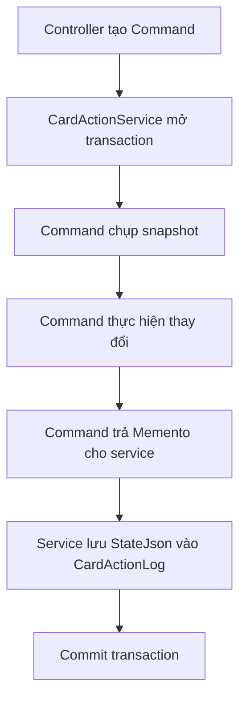

# Command, biến một thao tác thành object

## Chỉ cần nhớ một ý

Command đóng gói một yêu cầu thành object riêng.

Object đó mang theo:

- Người nào yêu cầu.
- Bộ thẻ nào bị tác động.
- Những thẻ nào được chọn.
- Cách thực hiện.
- Cách hoàn tác.

Trong project này, mỗi thao tác hàng loạt như xóa, đánh sao hoặc bỏ sao là một Command.

## Ví dụ dễ hiểu

Hãy tưởng tượng một phiếu yêu cầu ghi:

```text
Người yêu cầu: Bình
Công việc: Đánh sao
Bộ thẻ: 12
Các thẻ: 3, 5, 8
```

Người nhận phiếu không cần hỏi lại các thông tin trên. Phiếu đã mang đủ dữ liệu để thực hiện công việc.

`StarCardsCommand` chính là một phiếu yêu cầu như vậy dưới dạng object.

## Trước khi áp dụng Command, code sẽ ra sao?

Không có Command, controller hoặc service phải tự phân nhánh theo thao tác:

```csharp
if (action == BatchActionType.Delete)
{
    // Tải thẻ, chụp dữ liệu cũ rồi xóa.
}
else if (action == BatchActionType.Star)
{
    // Lưu trạng thái cũ rồi đặt IsStarred = true.
}
else if (action == BatchActionType.Unstar)
{
    // Lưu trạng thái cũ rồi đặt IsStarred = false.
}
```

Khi có nút Hoàn tác, mỗi nhánh lại cần thêm logic ngược:

```text
Xóa       -> tạo lại thẻ và dữ liệu liên quan
Đánh sao  -> trả IsStarred về giá trị cũ
Bỏ sao    -> trả IsStarred về giá trị cũ
```

Một service lớn sẽ phải biết cách chạy và hoàn tác mọi loại thao tác. Thêm hành động mới đồng nghĩa sửa tiếp service đó.

## Vì sao chọn Command cho chức năng này?

Mỗi thao tác có dữ liệu đầu vào giống nhau nhưng cách thực hiện khác nhau.

Project còn cần lưu lịch sử và hoàn tác. Command tự chụp trạng thái trước khi thay đổi rồi trả về một `CardActionMemento`. Cách Memento lưu trạng thái được giải thích riêng trong [tài liệu Memento](memento.md).

Command cũng cho phép `CardActionService` xử lý mọi thao tác theo cùng một quy trình:

```text
Mở transaction
Command xác thực target và chạy
Nhận Memento
Lưu Memento vào lịch sử
Commit
```

Validation nằm trong domain command chứ không chỉ dựa vào controller: user phải sở hữu bộ, ID phải hợp lệ, không trùng, thuộc đúng bộ và tồn tại. Vì vậy Delete/Star/Unstar đều thất bại trước mutation nếu target batch có một phần sai. Service không cần biết command đang xóa hay đánh sao.

## Command nằm ở đâu trong project?

| Vai trò GoF | Code |
| --- | --- |
| Command | [`ICardActionCommand`](../Services/CardActions/ICardActionCommand.cs) |
| Concrete Command | [`DeleteCardsCommand`](../Services/CardActions/DeleteCardsCommand.cs) |
| Concrete Command | [`StarCardsCommand`](../Services/CardActions/StarCardsCommand.cs) |
| Concrete Command | [`UnstarCardsCommand`](../Services/CardActions/UnstarCardsCommand.cs) |
| Invoker | [`CardActionService`](../Services/CardActions/CardActionService.cs) |
| Client | [`CardActionsController`](../Controllers/CardActionsController.cs) |
| Receiver | `AppDbContext` và các entity EF Core |

Interface chung:

```csharp
public interface ICardActionCommand
{
    string ActionType { get; }
    int SetId { get; }
    string UserId { get; }
    IReadOnlyList<int> CardIds { get; }

    Task<CardActionMemento> ExecuteAsync();
    Task UndoAsync(CardActionMemento memento);
}
```

Controller tạo command rồi đưa cho service:

```csharp
ICardActionCommand command = _commandFactory.Create(
    action.ToString(),
    setId,
    userId,
    selectedCardIds);

await _cardActionService.ExecuteAsync(command);
```

## Snapshot là gì?

Snapshot là dữ liệu cần thiết để quay về trạng thái cũ.

Với đánh sao, snapshot có thể rất nhỏ:

```text
Thẻ 3 trước đây: chưa đánh sao
Thẻ 5 trước đây: đã đánh sao
Thẻ 8 trước đây: chưa đánh sao
```

`StarCardsCommand.UndoAsync(memento)` đọc trạng thái trong Memento rồi trả từng thẻ về giá trị cũ.

Xóa phức tạp hơn. `DeleteCardsCommand` phải giữ nội dung thẻ và dữ liệu liên quan như `UserProgress`, `ReviewProgress`, `ReviewSessionItem`, metadata của `ReviewSession`, chi tiết nghe chép và từ mục tiêu của English Mission. Với active ReviewSession bị xóa hết item, snapshot còn ghi session đã bị cleanup để Undo tạo lại; session completed/ended giữ shell và metadata, chỉ khôi phục item. Nếu chỉ giữ ID thẻ, project không đủ dữ liệu để tạo lại bản ghi đã xóa.

## Luồng thực hiện



## Luồng hoàn tác

Khi người dùng bấm Hoàn tác:

1. `CardActionService` mở transaction và đọc `CardActionLog` của đúng user.
2. Factory tạo lại đúng loại command từ `ActionType`.
3. Service bọc `SnapshotJson` cũ thành `CardActionMemento`.
4. Command kiểm tra toàn bộ cấu trúc snapshot, quan hệ ID và conflict dữ liệu hiện tại trước lần ghi đầu tiên.
5. Command khôi phục theo thứ tự quan hệ: thẻ, session cha, progress và item/dữ liệu con.
6. Chỉ khi toàn bộ restore thành công, log mới được đánh dấu `UndoneAt`.
7. Transaction commit; lỗi malformed, conflict hoặc lỗi persistence làm toàn bộ Undo thất bại và không ghi đè dữ liệu mới.

```csharp
ICardActionCommand command = _commandFactory.Create(
    log.ActionType,
    log.SetId,
    userId,
    cardIds);

CardActionMemento memento = new(log.SnapshotJson);
await command.UndoAsync(memento);
```

## Acceptance và kiểm thử

Các test tại [`CardActionServiceTests.cs`](../tests/ltwnc.Tests/Services/CardActions/CardActionServiceTests.cs) kiểm chứng owner/cross-set/ID batch và Star/Unstar Undo all-or-nothing. Test round-trip Delete/Memento tại [`DeleteCardsMementoTests.cs`](../tests/ltwnc.Tests/Services/CardActions/DeleteCardsMementoTests.cs) kiểm chứng Review, Dictation, English Mission, lifecycle session, malformed/legacy snapshot và conflict trước restore.

## Vì sao không chỉ viết một method cho mỗi thao tác?

Ba method riêng vẫn có thể chạy được. Command trở nên phù hợp khi thao tác cần được truyền đi, ghi lịch sử và thực hiện lại theo một quy trình chung.

Nếu chức năng chỉ có một nút đơn giản và không cần undo, Command có thể là quá nhiều code. Ở đây yêu cầu undo và snapshot làm cho mẫu này có lý do rõ ràng.

## Tự kiểm tra

1. Command mang theo những thông tin nào?
2. Vì sao command cần snapshot?
3. `CardActionService` có cần biết cách xóa từng entity không?

Đáp án:

1. Loại thao tác, người dùng, bộ thẻ, danh sách thẻ và cách thực hiện.
2. Để khôi phục trạng thái trước khi thay đổi.
3. Không. Chi tiết đó nằm trong concrete command.

## Kết luận ngắn

Command biến thao tác hàng loạt thành một object có thể chạy, ghi lịch sử và hoàn tác. Nhờ đó `CardActionService` dùng cùng một quy trình cho Xóa, Đánh sao và Bỏ sao.
