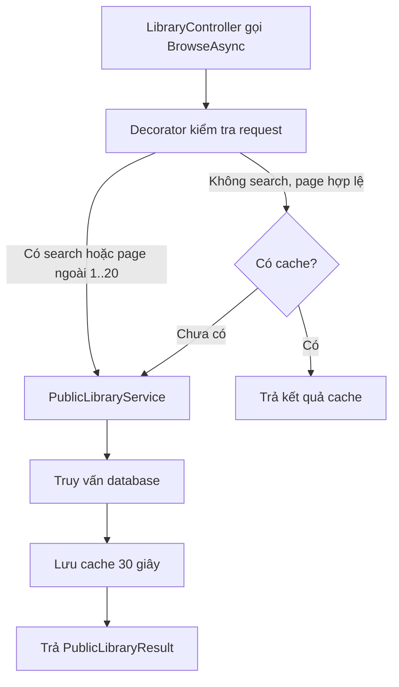

# Decorator, thêm trách nhiệm mà không sửa service gốc

## Chỉ cần nhớ một ý

Decorator bọc một object khác và cung cấp cùng contract với object được bọc.
Nó có thể thêm một trách nhiệm trước hoặc sau khi gọi object bên trong mà không
sửa class gốc.

Trong project này, Decorator thêm cache cho thư viện công khai:

```text
LibraryController
        |
        v
IPublicLibraryService
        |
        v
CachedPublicLibraryServiceDecorator
        |
        v
PublicLibraryService -> database
```

Controller chỉ biết `IPublicLibraryService`. Nó không cần biết mình đang nhận
service gốc hay service đã được bọc cache.

## Ví dụ dễ hiểu

Một thủ thư có thể nhận thêm một lớp trợ lý. Trợ lý kiểm tra tủ hồ sơ trước;
nếu đã có kết quả thì trả ngay, còn nếu chưa có thì nhờ thủ thư tìm, sau đó lưu
bản sao cho lần hỏi tiếp theo.

Thủ thư vẫn biết cách tìm sách. Trợ lý chỉ thêm cách phục vụ nhanh hơn.

`PublicLibraryService` là thủ thư. `CachedPublicLibraryServiceDecorator` là
trợ lý đứng trước nó.

## Trước khi áp dụng Decorator, code sẽ ra sao?

Nếu `LibraryController` gọi trực tiếp `PublicLibraryService`, mọi request đều
đi thẳng vào truy vấn database:

```csharp
public LibraryController(PublicLibraryService libraryService)
{
    _libraryService = libraryService;
}
```

Muốn cache, có thể đưa `IMemoryCache` vào `PublicLibraryService` và thêm các
nhánh cache vào cùng class:

```text
PublicLibraryService
├── lọc bộ thẻ công khai
├── phân trang và sắp xếp
└── kiểm tra cache, tạo key, đặt thời hạn
```

Cách này chạy được, nhưng service truy vấn sẽ vừa chứa nghiệp vụ thư viện vừa
chứa chính sách cache. Nếu muốn tắt cache, đổi thời hạn hoặc thêm một lớp
trang trí khác, class gốc lại phải sửa.

## Vì sao chọn Decorator cho chức năng này?

Cache là trách nhiệm bổ sung, không phải điều kiện để `PublicLibraryService`
trả dữ liệu đúng. Decorator cho phép tách hai việc:

- `PublicLibraryService` chỉ truy vấn các bộ thẻ công khai và tạo kết quả.
- `CachedPublicLibraryServiceDecorator` quyết định request nào được cache và
  chuyển request còn lại cho service bên trong.

Hai class cùng triển khai `IPublicLibraryService`, nên controller không đổi khi
DI thay implementation được bọc.

## Decorator nằm ở đâu trong project?

| Vai trò GoF | Code |
| --- | --- |
| Client | [`LibraryController`](../Controllers/LibraryController.cs) |
| Component | [`IPublicLibraryService`](../Services/PublicLibrary/IPublicLibraryService.cs) |
| Concrete Component | [`PublicLibraryService`](../Services/PublicLibrary/PublicLibraryService.cs) |
| Decorator | [`CachedPublicLibraryServiceDecorator`](../Services/PublicLibrary/CachedPublicLibraryServiceDecorator.cs) |
| Cấu hình Decorator | [`Program.cs`](../Program.cs) |

Contract chung chỉ có một thao tác:

```csharp
Task<PublicLibraryResult> BrowseAsync(
    PublicLibraryQuery query,
    CancellationToken cancellationToken = default);
```

Decorator nhận một `IPublicLibraryService` bên trong:

```csharp
public sealed class CachedPublicLibraryServiceDecorator : IPublicLibraryService
{
    private readonly IPublicLibraryService _inner;
    private readonly IMemoryCache _cache;
}
```

## DI lắp Decorator như thế nào?

Project đăng ký Concrete Component riêng, sau đó đăng ký `IPublicLibraryService`
trỏ tới Decorator:

```csharp
builder.Services.AddScoped<PublicLibraryService>();
builder.Services.AddScoped<IPublicLibraryService>(provider =>
    new CachedPublicLibraryServiceDecorator(
        provider.GetRequiredService<PublicLibraryService>(),
        provider.GetRequiredService<IMemoryCache>()));
```

`PublicLibraryService` được resolve trực tiếp để tránh việc Decorator lại phụ
thuộc vào chính `IPublicLibraryService` đang được tạo. Controller nhận
`IPublicLibraryService`, nhưng object thật là Decorator chứa service gốc.

## Decorator xử lý một request ra sao?

Decorator không cache mọi truy vấn. Nó chỉ cache request không có từ khóa tìm
kiếm và có trang từ 1 đến 20:

```csharp
if (!CanCache(query))
{
    return await _inner.BrowseAsync(query, cancellationToken);
}
```

Với request đủ điều kiện, các bước là:

1. Chuẩn hóa sort và lấy `Page` làm cache key.
2. Kiểm tra `IMemoryCache`.
3. Nếu chưa có kết quả, gọi `_inner.BrowseAsync(...)`.
4. Lưu kết quả thành công trong 30 giây.
5. Trả kết quả cho controller.



## Vì sao không cache từ khóa tùy ý?

Người dùng có thể nhập vô hạn từ khóa. Nếu mỗi từ khóa tạo một key, cache có
thể lớn không cần thiết. Project chỉ cache truy vấn không có search và giới
hạn page phổ biến đến 20.

Các quy tắc hiện tại là:

- Thời hạn cache: 30 giây.
- Tối đa 20 trang được cache.
- Request có search đi thẳng tới service gốc.
- Page ngoài phạm vi cũng đi thẳng tới service gốc.
- Cache key dùng record gồm sort đã chuẩn hóa và page, nên dùng value equality.
- Nếu service gốc ném lỗi hoặc request bị hủy, kết quả lỗi không được lưu.

Đây là chính sách cache nhỏ và có giới hạn rõ ràng, không phải một hệ thống
cache tổng quát cho mọi truy vấn.

## Decorator không thay đổi nghiệp vụ gốc

`PublicLibraryService` vẫn chịu trách nhiệm:

- Chỉ lấy bộ thẻ public và đang Active.
- Lọc theo tiêu đề, mô tả hoặc tên tác giả.
- Sắp xếp, phân trang và tạo `PublicLibraryResult`.

Decorator chỉ quyết định có đọc trước từ cache hay không. Những request không
được cache vẫn giữ nguyên `query` và `cancellationToken` khi chuyển cho `_inner`.

## Tự kiểm tra

1. Vì sao `LibraryController` chỉ cần phụ thuộc `IPublicLibraryService`?
2. Class nào thực hiện truy vấn database thật sự?
3. Request có từ khóa tìm kiếm có được lưu cache không?
4. Vì sao project đăng ký `PublicLibraryService` riêng trong DI?

Đáp án:

1. Vì Component và Decorator cùng triển khai một contract.
2. `PublicLibraryService`.
3. Không. Request đó được chuyển nguyên vẹn cho service gốc.
4. Để Decorator nhận Concrete Component mà không tạo vòng phụ thuộc qua
   `IPublicLibraryService`.

## Kết luận ngắn

Decorator cho phép project thêm cache mà không làm `PublicLibraryService` biết
về cache. `CachedPublicLibraryServiceDecorator` giữ cùng contract, bọc service
gốc và chỉ thêm trách nhiệm cho những request phù hợp.
