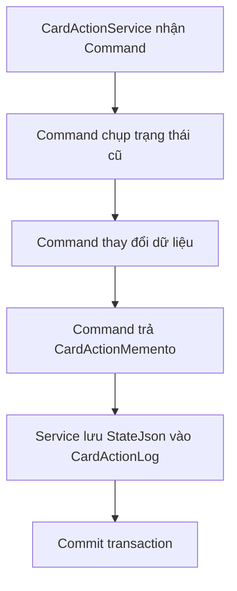
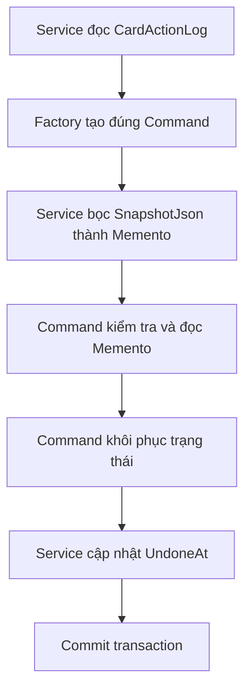

# Memento, giữ trạng thái cũ để có thể hoàn tác

## Chỉ cần nhớ một ý

Memento là một gói dữ liệu ghi lại trạng thái của object tại một thời điểm.

Khi cần hoàn tác, object nhận lại gói đó và tự khôi phục trạng thái cũ. Nơi giữ Memento không cần hiểu dữ liệu bên trong có ý nghĩa gì.

Trong project này, Memento giúp hoàn tác ba thao tác trên thẻ:

- Xóa nhiều thẻ.
- Đánh sao nhiều thẻ.
- Bỏ sao nhiều thẻ.

## Ví dụ dễ hiểu

Trước khi sửa một tài liệu, bạn lưu một bản sao dự phòng:

```text
Tài liệu hiện tại -> tạo bản sao -> sửa tài liệu
```

Nếu muốn quay lại, bạn đưa bản sao cho ứng dụng khôi phục:

```text
Bản sao đã lưu -> khôi phục -> tài liệu trở về trạng thái cũ
```

Người giữ bản sao không cần đọc và sửa từng câu trong đó. Họ chỉ cần biết bản sao nào thuộc lần chỉnh sửa nào.

`CardActionMemento` đóng vai trò bản sao dự phòng. `CardActionService` giữ nó trong lịch sử, còn từng Command biết cách dùng nó để Undo.

## Code trước khi áp dụng Memento

Cơ chế snapshot và Undo đã tồn tại, nhưng được biểu diễn bằng ba bước rời nhau:

```csharp
public interface ICardActionCommand
{
    Task ExecuteAsync();
    Task UndoAsync();
    string GetSnapshotJson();
    void LoadSnapshot(string json);
}
```

Khi thực hiện, service phải nhớ gọi Command rồi lấy snapshot:

```csharp
await command.ExecuteAsync();
string snapshot = command.GetSnapshotJson();
```

Khi hoàn tác, service lại phải nạp snapshot trước khi gọi Undo:

```csharp
command.LoadSnapshot(log.SnapshotJson);
await command.UndoAsync();
```

## Vấn đề của code cũ

`ExecuteAsync()` và snapshot là hai lời gọi riêng. Contract không buộc caller phải lấy snapshot sau khi thực hiện.

`LoadSnapshot()` và `UndoAsync()` cũng là hai lời gọi riêng. Caller có thể quên nạp snapshot hoặc command có thể giữ nhầm snapshot cũ trong field.

`CardActionService` phải biết trình tự sử dụng trạng thái tạm của Command dù service không nên hiểu cách hoàn tác từng loại hành động.

Code đã có ý tưởng của Memento nhưng chưa có object Memento rõ ràng.

## Vì sao chọn Memento?

Chức năng này có ba dấu hiệu phù hợp:

1. Cần ghi lại trạng thái trước khi thay đổi.
2. Cần khôi phục đúng trạng thái đó vào một thời điểm sau.
3. Nơi lưu lịch sử không nên biết cấu trúc snapshot của từng Command.

Snapshot của thao tác đánh sao là một bảng `cardId -> trạng thái sao cũ`. Snapshot của thao tác xóa phải chứa cả thẻ, tiến trình học, chi tiết nghe chép và từ mục tiêu English Mission.

`CardActionService` không cần phân tích hai cấu trúc này. Service chỉ lưu nguyên chuỗi JSON rồi trả nó cho đúng Command khi Undo.

## Các vai trò trong project

| Vai trò Memento | Code trong project | Trách nhiệm |
| --- | --- | --- |
| Memento | [`CardActionMemento`](../Services/CardActions/CardActionMemento.cs) | Bọc trạng thái JSON bất biến |
| Originator | `DeleteCardsCommand`, `StarCardsCommand`, `UnstarCardsCommand` | Tạo Memento và tự khôi phục từ Memento |
| Caretaker | [`CardActionService`](../Services/CardActions/CardActionService.cs) | Lưu và trả lại Memento, không phân tích nội dung |
| Kho lưu bền vững | [`CardActionLog.SnapshotJson`](../Models/Entities/CardActionLog.cs) | Giữ JSON để Undo ở request sau |

## Code sau khi áp dụng

Memento là một record bất biến:

```csharp
public sealed record CardActionMemento(string StateJson);
```

Contract mới gắn việc chụp trạng thái với Execute và gắn Memento trực tiếp với Undo:

```csharp
public interface ICardActionCommand
{
    string ActionType { get; }
    int SetId { get; }
    string UserId { get; }
    IReadOnlyList<int> CardIds { get; }

    Task<CardActionMemento> ExecuteAsync();
    Task UndoAsync(CardActionMemento memento);
}
```

Một Command đánh sao thực hiện ba bước:

```csharp
Dictionary<int, bool> previousStates = new();

foreach (Flashcard card in cards)
{
    previousStates[card.Id] = card.IsStarred;
    card.IsStarred = true;
}

await _context.SaveChangesAsync();
return new CardActionMemento(JsonSerializer.Serialize(previousStates));
```

Khi Undo, chính Command đọc kiểu snapshot mà nó đã tạo:

```csharp
Dictionary<int, bool> previousStates =
    CardActionMemento.Restore<Dictionary<int, bool>>(memento);

foreach (Flashcard card in cards)
{
    if (previousStates.TryGetValue(card.Id, out bool oldState))
    {
        card.IsStarred = oldState;
    }
}
```

## Luồng thực hiện



Điểm quan trọng là `ExecuteAsync()` không thể thành công mà quên trả Memento. Nếu việc tạo log thất bại, transaction không được commit nên thay đổi của Command cũng bị rollback.

## Luồng hoàn tác



`CardActionService` chỉ làm việc này:

```csharp
CardActionMemento memento = new(log.SnapshotJson);
await command.UndoAsync(memento);
```

Service không biết JSON là dictionary trạng thái sao hay danh sách snapshot thẻ đã xóa.

## Command và Memento khác nhau thế nào?

Hai mẫu phối hợp nhưng không thay thế nhau:

```text
Command  = yêu cầu phải làm gì
Memento  = trạng thái cũ cần giữ để quay lại
```

Ví dụ:

- `StarCardsCommand` nói: "Đánh sao các thẻ 3, 5 và 8".
- `CardActionMemento` nhớ: "Trước đó thẻ 3 và 8 chưa có sao, thẻ 5 đã có sao".

Command chứa hành vi. Memento chứa trạng thái phục vụ hành vi hoàn tác.

## Vì sao vẫn giữ SnapshotJson?

`CardActionMemento` là object dùng trong code đang chạy. Người dùng có thể Undo ở một request khác hoặc sau khi server khởi động lại, nên trạng thái vẫn phải được lưu vào database.

Project tiếp tục dùng `CardActionLog.SnapshotJson` vì:

- Không cần migration.
- Không đổi định dạng JSON cũ.
- Các log được tạo trước khi refactor vẫn Undo được.

Khi đọc log cũ, service chỉ bọc chuỗi JSON hiện có:

```csharp
new CardActionMemento(log.SnapshotJson)
```

## Nếu Memento bị hỏng thì sao?

Command kiểm tra Memento trước khi thay đổi dữ liệu. Chuỗi null, rỗng, JSON sai hoặc JSON giải mã thành `null` đều bị từ chối bằng lỗi:

```text
Dữ liệu hoàn tác không hợp lệ.
```

Transaction không commit và `UndoneAt` không được cập nhật. Hệ thống không báo Undo thành công khi dữ liệu chưa được khôi phục đầy đủ.

## Tự kiểm tra

1. Ai tạo Memento?
2. Ai giữ Memento giữa hai request?
3. `CardActionService` có cần biết cấu trúc JSON của thao tác xóa không?
4. Command và Memento có cùng trách nhiệm không?

Đáp án:

1. Concrete Command tạo Memento trước khi thay đổi trạng thái.
2. `CardActionService` lưu nó trong `CardActionLog.SnapshotJson`.
3. Không. `DeleteCardsCommand` tự đọc snapshot của nó.
4. Không. Command giữ hành vi, Memento giữ trạng thái cũ.

## Kết luận ngắn

Memento biến snapshot rời rạc thành một object rõ ràng. Command tự tạo và tự dùng Memento, còn `CardActionService` chỉ lưu giữ nó. Nhờ vậy luồng Undo khó bị gọi sai thứ tự hơn mà vẫn giữ nguyên database và dữ liệu lịch sử cũ.
