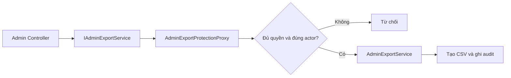

# Protection Proxy, kiểm tra quyền trước khi cho làm việc thật

## Chỉ cần nhớ một ý

Proxy là object đứng trước object thật. Caller gọi Proxy như thể đang gọi object thật.

Protection Proxy kiểm tra quyền trước. Nếu hợp lệ, nó chuyển lời gọi cho object thật. Nếu không hợp lệ, nó từ chối.

Trong project này, Proxy bảo vệ chức năng xuất CSV của Admin.

## Ví dụ dễ hiểu

Hãy hình dung phòng lưu hồ sơ có nhân viên bảo vệ đứng ngoài cửa.

```text
Người yêu cầu
      |
      v
Nhân viên bảo vệ kiểm tra thẻ
      |
      +----> Không hợp lệ: từ chối
      |
      +----> Hợp lệ: cho vào phòng hồ sơ
```

Nhân viên bảo vệ không tự chuẩn bị hồ sơ. Phòng hồ sơ mới làm công việc thật.

Trong project:

```text
AdminExportProtectionProxy = nhân viên bảo vệ
AdminExportService         = phòng tạo file CSV
```

## Trước khi áp dụng Proxy, code triển khai ra sao?

Trước đây DI nối interface thẳng với service thật:

```csharp
builder.Services.AddScoped<IAdminExportService, AdminExportService>();
```

Controller gọi `IAdminExportService` và đi thẳng vào `AdminExportService`.

Các route trong Admin đã được bảo vệ bằng `AdminAreaPolicy`. Khi request đi qua MVC đúng cách, khách chưa đăng nhập bị yêu cầu đăng nhập và người không phải Admin nhận HTTP 403.

Tuy nhiên, `AdminExportService` không tự kiểm tra policy. Code nội bộ khác có thể lấy service rồi gọi trực tiếp. Caller cũng truyền vào một `AdminExportActor` chứa `UserId` và `DisplayName` dùng để ghi audit.

```csharp
await exportService.ExportKpisAsync(
    7,
    new AdminExportActor("user-khac", "Tên giả"));
```

Nếu chỉ tin actor do caller gửi, audit có thể ghi sai người thực hiện.

## Vì sao chọn Protection Proxy cho chức năng này?

`AdminExportService` đã làm đúng nhiệm vụ tạo CSV và ghi audit cho lần xuất thành công. Không cần nhét thêm kiểm tra HTTP vào service thật.

Project cần một lớp đứng trước service để:

1. Yêu cầu phải có `HttpContext` hiện tại.
2. Kiểm tra đúng `AdminAreaPolicy` đang dùng ở MVC.
3. So sánh `actor.UserId` với claim người dùng hiện tại.
4. Bỏ `DisplayName` do caller gửi và dựng lại từ claim đáng tin cậy.
5. Chỉ gọi service thật sau khi mọi kiểm tra thành công.

Protection Proxy phù hợp vì nó giữ nguyên interface. Controller không cần thay cách gọi.

```text
Trước Proxy:
Controller -> IAdminExportService -> AdminExportService

Sau Proxy:
Controller -> IAdminExportService -> Protection Proxy -> AdminExportService
```

## Proxy nằm ở đâu trong project?

| Vai trò GoF | Code |
| --- | --- |
| Client | `DashboardController`, `AuditLogsController` |
| Subject | [`IAdminExportService`](../Services/AdminExports/IAdminExportService.cs) |
| Protection Proxy | [`AdminExportProtectionProxy`](../Services/AdminExports/AdminExportProtectionProxy.cs) |
| Real Subject | [`AdminExportService`](../Services/AdminExports/AdminExportService.cs) |
| Policy dùng chung | [`AdminAreaPolicy`](../Areas/Admin/AdminAreaPolicy.cs) |



## Vì sao Proxy và service thật có cùng interface?

Cả hai đều triển khai `IAdminExportService`:

```csharp
public sealed class AdminExportProtectionProxy : IAdminExportService
public sealed class AdminExportService : IAdminExportService
```

Vì vậy controller chỉ biết interface:

```csharp
private readonly IAdminExportService _exportService;
```

Controller không cần biết object nhận lời gọi đầu tiên là Proxy. DI quyết định điều đó.

## DI được đổi như thế nào?

Service thật được đăng ký để Proxy có thể gọi nó. `IAdminExportService` được trỏ tới Proxy:

```csharp
builder.Services.AddScoped<AdminExportService>();

builder.Services.AddScoped<IAdminExportService>(services =>
    new AdminExportProtectionProxy(
        services.GetRequiredService<AdminExportService>(),
        services.GetRequiredService<IAuthorizationService>(),
        services.GetRequiredService<IHttpContextAccessor>()));
```

Khi controller yêu cầu `IAdminExportService`, DI trả về `AdminExportProtectionProxy`.

## Proxy kiểm tra quyền như thế nào?

Proxy lấy người dùng từ `HttpContext` rồi dùng authorization service:

```csharp
AuthorizationResult result = await _authorizationService.AuthorizeAsync(
    httpContext.User,
    AdminAreaPolicy.Name);
```

Nó không tự viết lại luật "Admin là ai". Cả MVC và Proxy cùng dùng `AdminAreaPolicy.Name`. Nếu policy thay đổi, hai lớp bảo vệ vẫn theo cùng một quy tắc.

## Vì sao phải kiểm tra lại actor?

Controller truyền actor vào service vì service thật cần biết ai để ghi audit. Nhưng dữ liệu do caller truyền vào không được xem là bằng chứng danh tính.

Proxy đọc `ClaimTypes.NameIdentifier` từ cookie đã xác thực:

```csharp
string? userId = httpContext.User.FindFirstValue(
    ClaimTypes.NameIdentifier);
```

Nếu ID này khác `actor.UserId`, Proxy ném `UnauthorizedAccessException`.

Sau đó Proxy tạo actor mới:

```csharp
string displayName = httpContext.User.FindFirstValue(ClaimTypes.Name) ?? "Admin";
var trustedActor = new AdminExportActor(userId, displayName);
```

`DisplayName` giả do caller gửi không đi đến service thật.

## Vì sao vẫn giữ policy ở MVC?

Proxy không thay thế lớp bảo vệ route.

MVC policy vẫn cần để trả đúng hành vi HTTP:

```text
Khách chưa đăng nhập -> chuyển tới trang đăng nhập
Đã đăng nhập nhưng không phải Admin -> HTTP 403
```

Proxy là lớp phòng thủ thứ hai tại service. Nó bảo vệ cả lời gọi không đi qua controller.

Cách này được gọi là defense in depth, nghĩa là có nhiều lớp bảo vệ cho cùng dữ liệu nhạy cảm.

## Proxy có ghi audit khi từ chối không?

Không trong phạm vi hiện tại.

`AdminExportService` chỉ ghi audit khi xuất file thành công. Proxy từ chối trước khi gọi service thật. Nó cũng không dùng actor chưa đáng tin để tạo audit mới.

## Hai chức năng được bảo vệ

Proxy bảo vệ cả hai method của Subject:

- `ExportKpisAsync()` xuất KPI Admin.
- `ExportAuditLogsAsync()` xuất nhật ký quản trị.

Cả hai đều đi qua cùng method kiểm tra quyền và dựng lại actor.

## Tự kiểm tra

1. Proxy có tự tạo CSV không?
2. Vì sao không tin `DisplayName` do caller truyền vào?
3. Vì sao vẫn cần MVC policy khi đã có Proxy?

Đáp án:

1. Không. `AdminExportService` mới tạo CSV.
2. Vì caller có thể truyền tên giả. Proxy lấy tên từ claim đã xác thực.
3. MVC policy giữ phản hồi HTTP 401/403, còn Proxy bảo vệ service seam.

## Kết luận ngắn

Protection Proxy đứng trước service xuất CSV để kiểm tra Admin policy và danh tính actor. Chỉ lời gọi hợp lệ mới được chuyển đến `AdminExportService` để tạo file và ghi audit.
