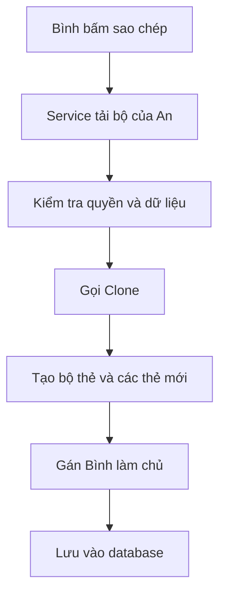

# Prototype, hiểu bằng ví dụ sao chép bộ thẻ

## Chỉ cần nhớ một ý

Prototype là cách tạo một bản sao mới từ một object đã có.

Bản sao giống bản gốc ở những phần cần giữ, nhưng hai bản là hai object riêng biệt. Sửa bản sao không làm thay đổi bản gốc.

Trong project này:

```text
Bộ thẻ của An
        |
        | Sao chép
        v
Bộ thẻ mới của Bình
```

Bộ của Bình giữ nội dung học từ bộ của An. Tuy nhiên, nó có ID mới, chủ mới và trạng thái riêng.

Đó là toàn bộ ý tưởng của Prototype.

## Một vài từ cần biết

Nếu mới học lập trình, có thể hiểu các từ trong tài liệu như sau:

| Từ | Cách hiểu đơn giản |
| --- | --- |
| Class | Bản thiết kế của một loại dữ liệu |
| Object | Một dữ liệu cụ thể được tạo từ class |
| Thuộc tính | Thông tin nằm trong object, ví dụ tiêu đề hoặc người sở hữu |
| Method | Một việc object có thể làm |
| `Clone()` | Method tạo bản sao |
| Entity | Class đại diện cho dữ liệu được lưu trong database |
| Service | Code điều khiển một quy trình nghiệp vụ |

Ví dụ, `FlashcardSet` là class. Bộ thẻ "Từ vựng du lịch của An" là một object cụ thể của class đó.

## Câu chuyện trong project

An có một bộ thẻ công khai:

```text
ID: 10
Tiêu đề: Từ vựng du lịch
Chủ sở hữu: An
Công khai: Có
Thẻ đã đánh sao: hotel
```

Bình bấm nút sao chép để đưa bộ thẻ này vào thư viện cá nhân.

Hệ thống không thể đưa thẳng bộ của An cho Bình. Nếu làm vậy, Bình sửa nội dung thì bộ của An cũng có thể bị ảnh hưởng.

Hệ thống phải tạo một bộ khác:

```text
ID: ID mới do database tạo
Tiêu đề: Từ vựng du lịch
Chủ sở hữu: Bình
Công khai: Không
Thẻ đã đánh sao: Chưa có
Nguồn sao chép: Bộ số 10 của An
```

Có ba nhóm dữ liệu:

1. Nội dung học cần được giữ lại.
2. Danh tính và trạng thái cá nhân phải được bỏ đi.
3. Thông tin của chủ mới được gán sau khi sao chép.

Method `Clone()` xử lý hai nhóm đầu. Service xử lý nhóm cuối.

## Vì sao không dùng dấu `=`?

Đoạn code sau không tạo bản sao:

```csharp
FlashcardSet copy = source;
```

Nó chỉ tạo thêm một tên gọi cho cùng một object.

Có thể hình dung như sau:

```text
source -----+
            +----> cùng một bộ thẻ
copy   -----+
```

Nếu thay đổi `copy.Title`, tiêu đề nhìn qua `source` cũng thay đổi vì cả hai đang trỏ đến cùng một chỗ.

`Clone()` tạo object thứ hai:

```csharp
FlashcardSet copy = source.Clone();
```

```text
source ----------> bộ thẻ gốc
copy   ----------> bộ thẻ mới
```

Lúc này hai bên độc lập.

## Prototype nằm ở đâu trong project?

Bạn chỉ cần biết bốn vị trí:

| File | Vai trò |
| --- | --- |
| [`IPrototype.cs`](../Models/IPrototype.cs) | Quy định object có thể gọi `Clone()` |
| [`FlashcardSet.cs`](../Models/Entities/FlashcardSet.cs) | Biết cách sao chép một bộ thẻ |
| [`Flashcard.cs`](../Models/Entities/Flashcard.cs) | Biết cách sao chép một thẻ |
| [`FlashcardSetService.cs`](../Services/FlashcardSets/FlashcardSetService.cs) | Kiểm tra điều kiện, gọi `Clone()` và lưu bản sao |

Tên gọi chuẩn của GoF được ghép như sau:

```text
Prototype           = IPrototype<T>
Concrete Prototype  = FlashcardSet và Flashcard
Client              = FlashcardSetService
```

Nếu các tên tiếng Anh này gây rối, có thể bỏ qua ở lần đọc đầu. Điều quan trọng là entity tự biết cách tạo bản sao, còn service quyết định lúc nào được phép sao chép.

## Quy trình chạy từng bước

Khi Bình sao chép một bộ thẻ, project làm lần lượt:

1. Service tìm bộ thẻ nguồn trong database.
2. Service kiểm tra bộ đó có công khai và hợp lệ không.
3. Service kiểm tra Bình đã sao chép bộ này trước đó chưa.
4. Service gọi `source.Clone()`.
5. Service gán Bình làm chủ và ghi lại ID của bộ nguồn.
6. EF Core lưu bộ mới vào database.



Đoạn code quan trọng nhất chỉ có vài dòng:

```csharp
FlashcardSet copy = source.Clone();
copy.UserId = learnerId;
copy.SourceSetId = source.Id;
copy.IsPublic = false;
```

Đọc bằng lời:

```text
Tạo bản sao từ bộ nguồn.
Gán người đang học làm chủ bản sao.
Ghi lại bản sao đến từ bộ nào.
Đặt bản sao ở chế độ riêng tư.
```

## Dữ liệu nào được giữ, dữ liệu nào bị reset?

### Bộ thẻ

| Dữ liệu | Sau khi sao chép |
| --- | --- |
| Tiêu đề | Giữ nguyên |
| Mô tả | Giữ nguyên |
| Danh sách thẻ | Sao chép thành danh sách mới |
| ID | Reset để database tạo ID mới |
| Chủ sở hữu | Bỏ chủ cũ, sau đó service gán Bình |
| Công khai | Chuyển thành riêng tư |
| Thời gian tạo | Đặt thành thời gian hiện tại |
| Trạng thái kiểm duyệt | Trở về trạng thái mặc định |

### Từng thẻ

| Dữ liệu | Sau khi sao chép |
| --- | --- |
| Từ vựng, nghĩa, phát âm và ví dụ | Giữ nguyên |
| Thứ tự thẻ | Giữ nguyên |
| ID của thẻ | Reset để database tạo ID mới |
| Đánh sao | Reset về chưa đánh sao |
| Đường dẫn ảnh đã upload | Bỏ đi vì file ảnh thật không được sao chép |
| URL ảnh bên ngoài | Giữ nguyên |

## Vì sao phải sao chép cả từng thẻ?

Một bộ thẻ chứa nhiều thẻ con. Tạo bộ mới thôi chưa đủ. Mỗi thẻ bên trong cũng phải là object mới.

Cách sai:

```text
Bộ của An   ----+
              +----> cùng một thẻ "hotel"
Bộ của Bình ----+
```

Cách đúng trong project:

```text
Bộ của An   ----> thẻ "hotel" gốc
Bộ của Bình ----> thẻ "hotel" mới
```

Đây là deep copy, nghĩa là sao chép cả object lớn và các object con bên trong.

`FlashcardSet.Clone()` làm việc đó bằng cách gọi `Clone()` cho từng thẻ:

```csharp
Flashcards = Flashcards
    .Select(card => card.Clone())
    .ToList();
```

Nhờ vậy, Bình sửa thẻ trong bản sao mà không làm thay đổi thẻ của An.

## Vì sao `Clone()` không tự lưu database?

`Clone()` chỉ có nhiệm vụ tạo object mới trong bộ nhớ.

Nó không kiểm tra quyền, không biết người dùng hiện tại và không lưu database. Những việc đó thuộc về `FlashcardSetService`.

Cách chia này giúp mỗi phần có một nhiệm vụ dễ hiểu:

```text
Clone()  = tạo bản sao đúng quy tắc
Service  = kiểm tra nghiệp vụ và lưu bản sao
```

## Một chi tiết dễ quên với EF Core

Trước khi gọi `Clone()`, service phải tải cả các thẻ con từ database:

```csharp
.Include(set => set.Flashcards)
```

Nếu không tải, `source.Flashcards` có thể rỗng dù database thật sự có thẻ. Khi đó bản sao sẽ bị thiếu nội dung.

Vì vậy project có thêm bước kiểm tra số thẻ đã tải. Nếu số lượng không khớp database, quá trình sao chép dừng lại.

Có thể nhớ như sau:

> `Clone()` chỉ sao chép dữ liệu đang có trong object. Nó không tự đi tìm dữ liệu còn thiếu trong database.

## Test kiểm tra điều gì?

Các test tại [`FlashcardSetCloneTests.cs`](../tests/ltwnc.Tests/Services/FlashcardSets/FlashcardSetCloneTests.cs) và [`FlashcardCloneTests.cs`](../tests/ltwnc.Tests/Services/FlashcardSets/FlashcardCloneTests.cs) xác nhận rằng:

- Bản sao là object mới.
- Nội dung học vẫn còn đủ.
- ID và chủ cũ không bị mang theo.
- Trạng thái đánh sao được reset.
- Sửa bản sao không ảnh hưởng bản gốc.

## Tự kiểm tra xem đã hiểu chưa

Hãy thử trả lời ba câu sau:

1. Vì sao không dùng `FlashcardSet copy = source;`?
2. Vì sao phải gọi `Clone()` cho từng thẻ con?
3. Vì sao `UserId` mới do service gán thay vì `Clone()` tự gán?

Đáp án:

1. Vì dấu `=` chỉ tạo thêm một biến trỏ đến cùng object, không tạo object mới.
2. Để thẻ trong bản sao không dùng chung object với thẻ gốc.
3. Vì entity không biết ai đang thực hiện thao tác. Service biết người dùng hiện tại và luật nghiệp vụ.

## Kết luận ngắn

Prototype trong project hoạt động như nút "Tạo một bản giống bộ này".

Nó giữ nội dung học, tạo object độc lập và reset dữ liệu thuộc về chủ cũ. Sau đó service gán chủ mới và lưu bản sao vào database.
