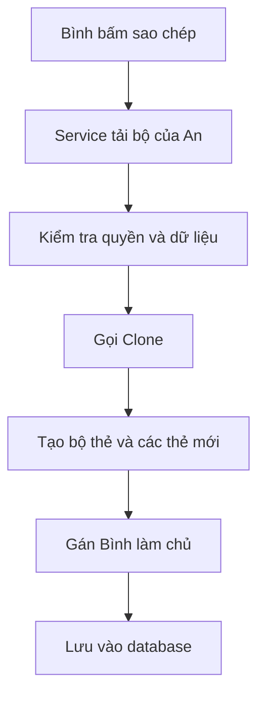

# Prototype, hiểu bằng ví dụ sao chép bộ thẻ

## Chỉ cần nhớ một ý

Prototype là cách tạo một bản sao mới từ một object đã có.

Bản sao giống bản gốc ở những phần cần giữ, nhưng hai bản là hai object riêng biệt. Sửa bản sao không làm thay đổi bản gốc.

Trong project này, Prototype được dùng cho hai luồng nhân bản:

```text
Bộ thẻ công khai của An  --CopyPublicSetAsync-->  Bộ riêng của Bình
Bộ thẻ của owner         --DuplicateOwnedSetAsync--> Bản sao mới của owner
```

Cả hai luồng đều tạo object và thẻ con mới từ `source.Clone()`. Chúng có ID mới, nhưng quy tắc dữ liệu giữ lại và reset khác nhau theo nghiệp vụ.

Đó là toàn bộ ý tưởng của Prototype.

## Một vài từ cần biết

Nếu mới học lập trình, có thể hiểu các từ trong tài liệu như sau:

| Từ | Cách hiểu đơn giản |
| --- | --- |
| Class | Bản thiết kế của một loại dữ liệu |
| Object | Một dữ liệu cụ thể được tạo từ class |
| Thuộc tính | Thông tin nằm trong object, ví dụ tiêu đề hoặc người sở hữu |
| Method | Một việc object có thể làm |
| `Clone()` | Method tạo bản sao |
| Entity | Class đại diện cho dữ liệu được lưu trong database |
| Service | Code điều khiển một quy trình nghiệp vụ |

Ví dụ, `FlashcardSet` là class. Bộ thẻ "Từ vựng du lịch của An" là một object cụ thể của class đó.

## Câu chuyện trong project

An có một bộ thẻ công khai:

```text
ID: 10
Tiêu đề: Từ vựng du lịch
Chủ sở hữu: An
Công khai: Có
Thẻ đã đánh sao: hotel
```

Bình bấm nút sao chép để đưa bộ thẻ này vào thư viện cá nhân.

Hệ thống không thể đưa thẳng bộ của An cho Bình. Nếu làm vậy, Bình sửa nội dung thì bộ của An cũng có thể bị ảnh hưởng.

Hệ thống phải tạo một bộ khác:

```text
ID: ID mới do database tạo
Tiêu đề: Từ vựng du lịch
Chủ sở hữu: Bình
Công khai: Không
Thẻ đã đánh sao: Chưa có
Nguồn sao chép: Bộ số 10 của An
```

Có ba nhóm dữ liệu:

1. Nội dung học cần được giữ lại.
2. Danh tính và trạng thái cá nhân phải được bỏ đi.
3. Thông tin của chủ mới được gán sau khi sao chép.

Method `Clone()` xử lý hai nhóm đầu. Service xử lý nhóm cuối.

## Trước khi áp dụng Prototype, code được viết như thế nào?

Trước đây, `FlashcardSetService` tự tạo bộ thẻ mới rồi chép từng thuộc tính từ bộ nguồn.

Code cũ có dạng như sau:

```csharp
var copy = new FlashcardSet
{
    Title = source.Title,
    Description = source.Description,
    UserId = learnerId,
    IsPublic = false,
    SourceSetId = source.Id,
    CreatedAt = DateTime.UtcNow,
    UpdatedAt = DateTime.UtcNow
};
```

Sau đó service tiếp tục tự tạo bản sao cho từng thẻ:

```csharp
copy.Flashcards = source.Flashcards.Select(card => new Flashcard
{
    FrontText = card.FrontText,
    BackText = card.BackText,
    Pronunciation = card.Pronunciation,
    PartOfSpeech = card.PartOfSpeech,
    ExampleSentence = card.ExampleSentence,
    ExampleMeaning = card.ExampleMeaning,
    IsStarred = card.IsStarred,
    UploadedImagePath = card.UploadedImagePath
}).ToList();
```

Cách này vẫn tạo được bản sao. Vấn đề là service phải biết quá nhiều chi tiết của `FlashcardSet` và `Flashcard`.

Trong cùng một method, service phải làm tất cả các việc sau:

```text
Kiểm tra bộ nguồn
Kiểm tra quyền sao chép
Kiểm tra bản sao đã tồn tại chưa
Nhớ từng thuộc tính cần sao chép
Nhớ từng thuộc tính cần reset
Tạo bản sao cho từng thẻ
Lưu database
```

Method trở nên dài và khó kiểm tra. Khi entity có thêm một thuộc tính, lập trình viên phải nhớ quay lại service để sửa đoạn sao chép.

Ở luồng copy public, `IsStarred` và `UploadedImagePath` không được mang sang người học mới:

- `IsStarred` là lựa chọn cá nhân của An, không phải của Bình.
- `UploadedImagePath` chỉ là đường dẫn đến file ảnh cũ. Chép đường dẫn không tạo ra một file ảnh mới.

Luồng `DuplicateOwnedSetAsync` có nghiệp vụ khác: owner muốn giữ lựa chọn sao và ảnh. Service tạo một file ảnh mới, sao chép ReviewSettings, nhưng không sao chép `ReviewProgress` hay lịch sử học. Hai chính sách khác nhau được đặt ở service sau khi dùng chung `Clone()`, thay vì làm `Clone()` biết người gọi là ai.

## Vì sao chọn Prototype cho chức năng này?

Hai chức năng sao chép bộ thẻ có đúng các dấu hiệu phù hợp với Prototype.

### Đã có sẵn một object làm mẫu

Service đã tải `source`, tức bộ thẻ của An, từ database. Object mới của Bình phần lớn giống object này. Vì vậy tạo bản sao từ `source` tự nhiên hơn việc dựng lại mọi thuộc tính trong service.

### Bản sao giống bản gốc nhưng không giống hoàn toàn

Nội dung học cần được giữ, còn ID, chủ sở hữu, quyền công khai và trạng thái cá nhân phải thay đổi. `Clone()` là nơi ghi rõ quy tắc giữ gì và bỏ gì.

### Object có nhiều object con

Một `FlashcardSet` chứa nhiều `Flashcard`. Mỗi thẻ cũng phải được tạo thành object mới. Prototype cho phép `FlashcardSet.Clone()` gọi tiếp `Flashcard.Clone()` để tạo deep copy.

### Entity hiểu dữ liệu của nó rõ nhất

`Flashcard` biết thuộc tính nào là nội dung học và thuộc tính nào là trạng thái cá nhân. Đặt quy tắc sao chép trong `Flashcard.Clone()` giúp service không cần biết chi tiết đó.

Có thể so sánh ngắn gọn:

```text
Trước Prototype:
Service tự chép từng thuộc tính của bộ thẻ và từng thẻ con.

Sau Prototype:
Service yêu cầu source.Clone() tạo bản sao đúng quy tắc.
```

Code trong service được rút từ một khối sao chép dài thành:

```csharp
FlashcardSet copy = source.Clone();
copy.UserId = learnerId;
copy.SourceSetId = source.Id;
copy.IsPublic = false;
```

Prototype không được chọn chỉ để code ngắn hơn. Nó được chọn để quy tắc sao chép nằm đúng chỗ và không bị rải trong service.

## Vì sao không dùng dấu `=`?

Đoạn code sau không tạo bản sao:

```csharp
FlashcardSet copy = source;
```

Nó chỉ tạo thêm một tên gọi cho cùng một object.

Có thể hình dung như sau:

```text
source -----+
            +----> cùng một bộ thẻ
copy   -----+
```

Nếu thay đổi `copy.Title`, tiêu đề nhìn qua `source` cũng thay đổi vì cả hai đang trỏ đến cùng một chỗ.

`Clone()` tạo object thứ hai:

```csharp
FlashcardSet copy = source.Clone();
```

```text
source ----------> bộ thẻ gốc
copy   ----------> bộ thẻ mới
```

Lúc này hai bên độc lập.

## Prototype nằm ở đâu trong project?

Bạn chỉ cần biết bốn vị trí:

| File | Vai trò |
| --- | --- |
| [`IPrototype.cs`](../Models/IPrototype.cs) | Quy định object có thể gọi `Clone()` |
| [`FlashcardSet.cs`](../Models/Entities/FlashcardSet.cs) | Biết cách sao chép một bộ thẻ |
| [`Flashcard.cs`](../Models/Entities/Flashcard.cs) | Biết cách sao chép một thẻ |
| [`FlashcardSetService.cs`](../Services/FlashcardSets/FlashcardSetService.cs) | Kiểm tra điều kiện, gọi `Clone()` và lưu bản sao public hoặc bản sao owner |

Tên gọi chuẩn của GoF được ghép như sau:

```text
Prototype           = IPrototype<T>
Concrete Prototype  = FlashcardSet và Flashcard
Client              = FlashcardSetService
```

Nếu các tên tiếng Anh này gây rối, có thể bỏ qua ở lần đọc đầu. Điều quan trọng là entity tự biết cách tạo bản sao, còn service quyết định lúc nào được phép sao chép.

## Quy trình chạy từng bước

Khi Bình sao chép một bộ thẻ, project làm lần lượt:

1. Service tìm bộ thẻ nguồn trong database.
2. Service kiểm tra bộ đó có công khai và hợp lệ không.
3. Service kiểm tra Bình đã sao chép bộ này trước đó chưa.
4. Service gọi `source.Clone()`.
5. Service gán Bình làm chủ và ghi lại ID của bộ nguồn.
6. EF Core lưu bộ mới vào database.



Đoạn code quan trọng nhất của copy public chỉ có vài dòng:

```csharp
FlashcardSet copy = source.Clone();
copy.UserId = learnerId;
copy.SourceSetId = source.Id;
copy.IsPublic = false;
```

Với owner duplication, service vẫn bắt đầu bằng `source.Clone()`, sau đó đặt `SourceSetId = null`, tạo tiêu đề hậu tố `(Bản sao)`, giữ `ReviewPaused`/`NewCardQuota`, khôi phục `IsStarred` và sao chép file upload trong transaction.
Đọc bằng lời:

```text
Tạo bản sao từ bộ nguồn.
Gán người đang học làm chủ bản sao.
Ghi lại bản sao đến từ bộ nào.
Đặt bản sao ở chế độ riêng tư.
```

## Dữ liệu nào được giữ, dữ liệu nào bị reset?

### Bộ thẻ

| Dữ liệu | Sau khi sao chép |
| --- | --- |
| Tiêu đề | Giữ nguyên |
| Mô tả | Giữ nguyên |
| Danh sách thẻ | Sao chép thành danh sách mới |
| ID | Reset để database tạo ID mới |
| Chủ sở hữu | Bỏ chủ cũ, sau đó service gán Bình |
| Công khai | Chuyển thành riêng tư |
| Thời gian tạo | Đặt thành thời gian hiện tại |
| Trạng thái kiểm duyệt | Trở về trạng thái mặc định |

### Từng thẻ trong copy public

| Dữ liệu | Sau khi sao chép |
| --- | --- |
| Từ vựng, nghĩa, phát âm và ví dụ | Giữ nguyên |
| Thứ tự thẻ | Giữ nguyên |
| ID của thẻ | Reset để database tạo ID mới |
| Đánh sao | Reset về chưa đánh sao |
| Đường dẫn ảnh đã upload | Bỏ đi vì file ảnh thật không được sao chép |
| URL ảnh bên ngoài | Giữ nguyên |

### Owner duplication

| Dữ liệu | Sau khi nhân bản |
| --- | --- |
| Nội dung, thứ tự và URL ảnh | Giữ nguyên |
| ID bộ/thẻ | Reset để database tạo ID mới |
| Đánh sao | Giữ nguyên |
| Ảnh upload | Tạo file mới, không dùng chung path |
| ReviewSettings | Sao chép cấu hình của owner |
| ReviewProgress và StudySession history | Không sao chép |
| SourceSetId | Đặt `null` vì đây là bản sao do chính owner tạo |

## Vì sao phải sao chép cả từng thẻ?

Một bộ thẻ chứa nhiều thẻ con. Tạo bộ mới thôi chưa đủ. Mỗi thẻ bên trong cũng phải là object mới.

Cách sai:

```text
Bộ của An   ----+
              +----> cùng một thẻ "hotel"
Bộ của Bình ----+
```

Cách đúng trong project:

```text
Bộ của An   ----> thẻ "hotel" gốc
Bộ của Bình ----> thẻ "hotel" mới
```

Đây là deep copy, nghĩa là sao chép cả object lớn và các object con bên trong.

`FlashcardSet.Clone()` làm việc đó bằng cách gọi `Clone()` cho từng thẻ:

```csharp
Flashcards = Flashcards
    .Select(card => card.Clone())
    .ToList();
```

Nhờ vậy, Bình sửa thẻ trong bản sao mà không làm thay đổi thẻ của An.

## Vì sao `Clone()` không tự lưu database?

`Clone()` chỉ có nhiệm vụ tạo object mới trong bộ nhớ.

Nó không kiểm tra quyền, không biết người dùng hiện tại và không lưu database. Những việc đó thuộc về `FlashcardSetService`.

Cách chia này giúp mỗi phần có một nhiệm vụ dễ hiểu:

```text
Clone()  = tạo bản sao đúng quy tắc
Service  = kiểm tra nghiệp vụ và lưu bản sao
```

## Một chi tiết dễ quên với EF Core

Trước khi gọi `Clone()`, service phải tải cả các thẻ con từ database:

```csharp
.Include(set => set.Flashcards)
```

Nếu không tải, `source.Flashcards` có thể rỗng dù database thật sự có thẻ. Khi đó bản sao sẽ bị thiếu nội dung.

Vì vậy project có thêm bước kiểm tra số thẻ đã tải. Nếu số lượng không khớp database, quá trình sao chép dừng lại.

Có thể nhớ như sau:

> `Clone()` chỉ sao chép dữ liệu đang có trong object. Nó không tự đi tìm dữ liệu còn thiếu trong database.

## Test kiểm tra điều gì?

Các test tại [`DuplicateOwnedSetTests.cs`](../tests/ltwnc.Tests/Services/FlashcardSets/DuplicateOwnedSetTests.cs) và [`ReviewHardeningTests.cs`](../tests/ltwnc.Tests/Services/FlashcardSets/ReviewHardeningTests.cs) xác nhận các luồng Prototype hiện tại:

- Copy/duplicate tạo bộ và thẻ mới với ID mới.
- Copy public reset Review policy và không mang `ReviewProgress`.
- Owner duplication giữ sao, tạo file ảnh mới và sao chép ReviewSettings.
- ReviewProgress và StudySession history của nguồn vẫn thuộc nguồn.
- Lỗi ảnh hoặc database dọn file và không để lại bản sao dở dang.

## Tự kiểm tra xem đã hiểu chưa

Hãy thử trả lời ba câu sau:

1. Vì sao không dùng `FlashcardSet copy = source;`?
2. Vì sao phải gọi `Clone()` cho từng thẻ con?
3. Vì sao `UserId` mới do service gán thay vì `Clone()` tự gán?

Đáp án:

1. Vì dấu `=` chỉ tạo thêm một biến trỏ đến cùng object, không tạo object mới.
2. Để thẻ trong bản sao không dùng chung object với thẻ gốc.
3. Vì entity không biết ai đang thực hiện thao tác. Service biết người dùng hiện tại và luật nghiệp vụ.

## Kết luận ngắn

Prototype trong project hoạt động như nút "Tạo một bản giống bộ này" cho cả copy public và owner duplication.

Nó luôn giữ nội dung học và tạo object độc lập. Copy public reset dữ liệu cá nhân rồi gán learner và source lineage; owner duplication giữ sao, sao chép ReviewSettings/ảnh bằng dữ liệu mới, nhưng không sao chép progress hay lịch sử. Service áp chính sách phù hợp và lưu bản sao vào database.
