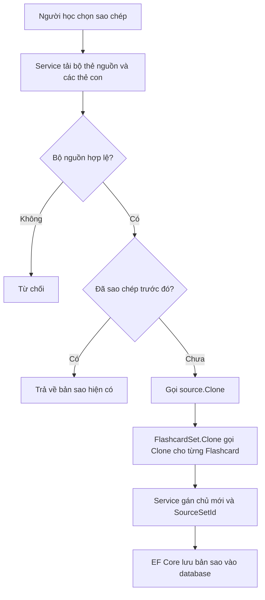

# Prototype: tạo bản sao đúng quy tắc

## 1. Prototype là gì?

Prototype là một mẫu thiết kế thuộc nhóm khởi tạo của GoF. Ý tưởng của nó rất đơn giản:

> Khi cần một object mới giống object đã có, hãy yêu cầu object gốc tự tạo bản sao.

Ví dụ ngoài đời: bạn có một bộ tài liệu mẫu. Khi người khác cần dùng, bạn photocopy bộ đó rồi ghi tên người nhận lên bản mới. Bạn không lấy bản gốc đưa cho họ, cũng không viết lại toàn bộ tài liệu từ đầu.

Trong code, phương thức thường có tên `Clone()`:

```csharp
FlashcardSet copy = source.Clone();
```

`source` là bản gốc. `copy` là object mới.

## 2. Project này cần Prototype để làm gì?

Ứng dụng cho phép người học sao chép một bộ thẻ công khai vào thư viện riêng.

Giả sử An tạo bộ thẻ "Từ vựng du lịch". Bình muốn học bộ này. Hệ thống cần tạo một bộ mới cho Bình với các yêu cầu sau:

- Giữ tiêu đề, mô tả và nội dung các thẻ.
- Tạo ID mới trong database.
- Đổi chủ sở hữu từ An sang Bình.
- Không mang trạng thái đánh sao cá nhân của An sang Bình.
- Bản sao phải ở chế độ riêng tư.
- Sửa bản sao không được làm thay đổi bản gốc.

Đây không phải thao tác sao chép mọi thuộc tính một cách máy móc. Một số dữ liệu phải giữ, một số dữ liệu phải bỏ, một số dữ liệu phải được gán lại. Prototype gom quy tắc đó vào `Clone()` của từng loại object.

## 3. Các vai trò GoF trong project

| Vai trò | Code trong project | Nhiệm vụ |
| --- | --- | --- |
| Prototype | [`IPrototype<T>`](../Models/IPrototype.cs) | Quy định object có phương thức `Clone()` |
| Concrete Prototype | [`FlashcardSet`](../Models/Entities/FlashcardSet.cs) | Tạo bản sao của bộ thẻ |
| Concrete Prototype | [`Flashcard`](../Models/Entities/Flashcard.cs) | Tạo bản sao của từng thẻ |
| Client | [`FlashcardSetService.CopyPublicSetAsync`](../Services/FlashcardSets/FlashcardSetService.cs) | Lấy bộ nguồn, gọi `Clone()`, gán chủ mới và lưu database |

Interface chung chỉ có một việc:

```csharp
public interface IPrototype<T> where T : class
{
    T Clone();
}
```

Một class triển khai interface này phải biết cách tạo bản sao của chính nó:

```csharp
public class FlashcardSet : IPrototype<FlashcardSet>
{
    public FlashcardSet Clone()
    {
        // Tạo và trả về một FlashcardSet mới.
    }
}
```

## 4. Luồng sao chép bộ thẻ



Đoạn chính trong service:

```csharp
FlashcardSet copy = source.Clone();
copy.UserId = learnerId;
copy.SourceSetId = source.Id;
copy.IsPublic = false;

_context.FlashcardSets.Add(copy);
await _context.SaveChangesAsync();
```

Có hai phần trách nhiệm rõ ràng:

1. Entity quyết định dữ liệu nào được giữ hoặc reset khi clone.
2. Service kiểm tra nghiệp vụ, gán người sở hữu mới và lưu database.

## 5. `FlashcardSet.Clone()` làm gì?

Bản rút gọn của code thật:

```csharp
public FlashcardSet Clone()
{
    var now = DateTime.UtcNow;

    return new FlashcardSet
    {
        Title = Title,
        Description = Description,
        IsPublic = false,
        CreatedAt = now,
        UpdatedAt = now,
        Flashcards = Flashcards
            .OrderBy(card => card.OrderIndex)
            .Select(card => card.Clone())
            .ToList()
    };
}
```

Các thuộc tính không được gán sẽ nhận giá trị mặc định của một object mới. Ví dụ, `Id` là `0` để EF Core tạo ID mới.

| Thuộc tính của bộ thẻ | Kết quả sau `Clone()` | Lý do |
| --- | --- | --- |
| `Title`, `Description` | Giữ nguyên | Đây là nội dung của bộ thẻ |
| `Flashcards` | Tạo danh sách và thẻ mới | Bản sao phải độc lập với bản gốc |
| `Id` | `0` | EF Core sẽ cấp ID mới |
| `UserId` | Chuỗi rỗng, sau đó service gán người học | Không được giữ chủ cũ |
| `SourceSetId` | `null`, sau đó service gán ID bộ nguồn | Ghi lại bản sao đến từ đâu |
| `IsPublic` | `false` | Bản sao vào thư viện riêng |
| `CreatedAt`, `UpdatedAt` | Thời điểm hiện tại | Đây là bản ghi mới |
| Dữ liệu kiểm duyệt | Trở về mặc định | Bản sao không mang quyết định kiểm duyệt của bản gốc |

## 6. `Flashcard.Clone()` làm gì?

Mỗi thẻ con cũng tự biết cách clone:

```csharp
public Flashcard Clone()
{
    return new Flashcard
    {
        FrontText = FrontText,
        BackText = BackText,
        Pronunciation = Pronunciation,
        PartOfSpeech = PartOfSpeech,
        ExampleSentence = ExampleSentence,
        ExampleMeaning = ExampleMeaning,
        Synonyms = Synonyms,
        ImageUrl = ImageUrl,
        UploadedImagePath = null,
        IsStarred = false,
        OrderIndex = OrderIndex
    };
}
```

Nội dung học được giữ lại. Dữ liệu gắn với bản ghi cũ hoặc người dùng cũ được reset:

- `Id` và `FlashcardSetId` trở về `0` để EF Core tạo quan hệ mới.
- `IsStarred` trở về `false` vì Bình không nên nhận trạng thái đánh sao của An.
- `UploadedImagePath` trở về `null` vì code không sao chép file ảnh vật lý trên ổ đĩa.
- `ImageUrl` được giữ vì đó chỉ là URL ảnh bên ngoài.

## 7. Deep copy và shallow copy

Đây là phần dễ gây lỗi nhất khi học Prototype.

### Shallow copy

Shallow copy tạo object bộ thẻ mới nhưng vẫn dùng chung các object thẻ con:

```csharp
var copy = new FlashcardSet
{
    Flashcards = source.Flashcards
};
```

Nếu sửa một thẻ trong `copy`, thẻ trong `source` cũng đổi vì hai bộ đang trỏ đến cùng object.

### Deep copy

Project dùng deep copy:

```csharp
Flashcards = Flashcards
    .Select(card => card.Clone())
    .ToList();
```

Code tạo một danh sách mới và gọi `Clone()` cho từng thẻ. Vì vậy:

```text
Bộ gốc  -> Thẻ gốc
Bản sao -> Thẻ mới
```

Hai bên không dùng chung object. Sửa bản sao không ảnh hưởng bản gốc.

## 8. Vì sao không dùng `MemberwiseClone()`?

`MemberwiseClone()` chỉ tạo shallow copy. Collection `Flashcards` vẫn có thể được dùng chung. Nó cũng sao chép các giá trị không nên giữ như ID, chủ sở hữu và trạng thái cá nhân.

Project viết `Clone()` tường minh để người đọc thấy ngay:

- Thuộc tính nào được giữ.
- Thuộc tính nào bị reset.
- Object con nào cần deep copy.

Khi thêm thuộc tính mới vào entity, lập trình viên phải quyết định rõ thuộc tính đó thuộc nhóm nào.

## 9. Một điều kiện quan trọng với EF Core

`FlashcardSet.Clone()` chỉ clone các thẻ đang có trong `source.Flashcards`. Nó không tự truy vấn database.

Vì vậy service phải tải navigation `Flashcards` trước:

```csharp
FlashcardSet? source = await _context.FlashcardSets
    .AsNoTracking()
    .Include(set => set.Flashcards.OrderBy(card => card.OrderIndex))
    .FirstOrDefaultAsync(set => set.Id == sourceSetId);
```

Service còn so sánh số thẻ đã tải với số thẻ trong database. Nếu hai số khác nhau, service dừng lại thay vì âm thầm tạo một bản sao thiếu thẻ.

Có thể nhớ ngắn gọn như sau:

> `Clone()` sao chép object đang có trong bộ nhớ, không sao chép dữ liệu chưa được tải từ database.

## 10. Prototype không chịu trách nhiệm cho việc gì?

`Clone()` không làm các việc sau:

- Kiểm tra bộ nguồn có công khai hay không.
- Kiểm tra người dùng có đang sao chép bộ của chính mình hay không.
- Kiểm tra người dùng đã sao chép bộ này trước đó chưa.
- Gán chủ sở hữu mới.
- Lưu dữ liệu vào database.

Những việc đó thuộc `FlashcardSetService`. Nếu đưa tất cả vào `Clone()`, entity sẽ phải biết người dùng hiện tại, database và luật truy cập. Khi đó `Clone()` không còn là thao tác tạo bản sao đơn giản nữa.

## 11. Test chứng minh điều gì?

Các test nằm tại:

- [`FlashcardSetCloneTests`](../tests/ltwnc.Tests/Services/FlashcardSets/FlashcardSetCloneTests.cs)
- [`FlashcardCloneTests`](../tests/ltwnc.Tests/Services/FlashcardSets/FlashcardCloneTests.cs)

Chúng kiểm tra những hành vi chính:

- Bản sao là object mới.
- ID và khóa ngoại được reset.
- Nội dung học được giữ nguyên.
- Danh sách thẻ được deep copy.
- `IsPublic`, `IsStarred` và đường dẫn ảnh upload được reset.
- Sửa bản sao không làm thay đổi bản gốc.

Có thể chạy riêng các test này bằng lệnh:

```bash
dotnet test tests/ltwnc.Tests/ltwnc.Tests.csproj --filter "FullyQualifiedName~FlashcardSetCloneTests|FullyQualifiedName~FlashcardCloneTests"
```

## 12. Khi nào nên dùng Prototype?

Prototype phù hợp khi:

- Object mới phần lớn giống một object đã có.
- Việc sao chép có quy tắc rõ về dữ liệu giữ lại và dữ liệu reset.
- Object có nhiều object con cần deep copy.
- Muốn đặt chính sách sao chép gần class sở hữu dữ liệu.

Không cần Prototype nếu chỉ tạo một object đơn giản với vài thuộc tính. Khi đó `new` hoặc một hàm tạo nhỏ thường dễ hiểu hơn.

## 13. Tóm tắt trong một câu

Trong project này, Prototype giúp biến một bộ thẻ công khai thành bản sao độc lập cho người học: giữ nội dung, bỏ danh tính và trạng thái cá nhân của bản gốc, rồi để service gán chủ mới và lưu vào database.
