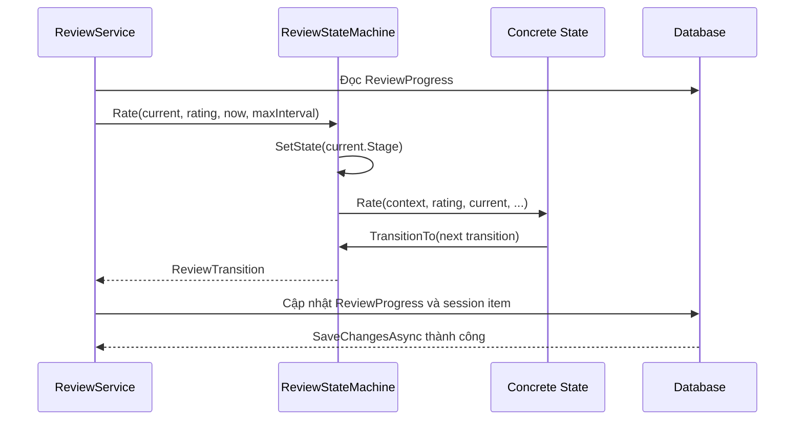

# State, mỗi giai đoạn có hành vi ôn tập riêng

## Chỉ cần nhớ một ý

State đặt hành vi phụ thuộc vào trạng thái hiện tại vào những object riêng.
Context giữ State hiện tại và chuyển lời gọi cho State đó. Khi xử lý xong, State
có thể yêu cầu Context chuyển sang State kế tiếp.

Trong project này, một thẻ có bốn giai đoạn ôn tập:

```text
New -> Learning -> Reviewing
                 |
                 v
             Relearning
```

Mỗi giai đoạn xử lý cùng một hành động `Rate`, nhưng kết quả của `Again`,
`Hard`, `Good` và `Easy` khác nhau.

## Ví dụ dễ hiểu

Một người học từ mới có thể ở các giai đoạn khác nhau:

- **New:** chưa từng được đánh giá.
- **Learning:** đang học ngắn hạn.
- **Reviewing:** đã nhớ đủ để ôn theo khoảng cách dài hơn.
- **Relearning:** từng quên sau khi đã vào lịch ôn dài hạn.

Bấm cùng một nút `Good` không có nghĩa giống nhau ở mọi giai đoạn. Với thẻ
mới, nó có thể đưa thẻ vào lịch ôn. Với thẻ đang Reviewing, nó có thể nhân đôi
khoảng cách ôn hiện tại.

## Trước khi áp dụng State, code sẽ ra sao?

Nếu đặt toàn bộ luật trong `ReviewService`, method đánh giá sẽ phải kiểm tra
cả stage lẫn rating:

```csharp
if (current.Stage == ReviewStage.New)
{
    // Again -> Learning, Good -> Reviewing...
}
else if (current.Stage == ReviewStage.Learning)
{
    // Again giữ Learning, Good -> Reviewing...
}
else if (current.Stage == ReviewStage.Reviewing)
{
    // Again -> Relearning, Good nhân khoảng cách...
}
else if (current.Stage == ReviewStage.Relearning)
{
    // Tính lại lịch sau khi quên...
}
```

Khi thêm giai đoạn hoặc thay đổi luật của một giai đoạn, method của service sẽ
phình to và phải sửa nhiều nhánh. Quy tắc chuyển trạng thái cũng bị trộn với
việc đọc và ghi `ReviewProgress`.

## Vì sao chọn State cho chức năng này?

Mỗi giai đoạn là một cách xử lý có cùng contract nhưng khác thuật toán. State
giúp tách rõ:

- `ReviewStateMachine` điều phối và giữ State hiện tại.
- Concrete State tính transition cho stage của nó.
- `ReviewService` đọc dữ liệu, lưu dữ liệu và không biết chi tiết từng rating.

Luồng sau khi tách trở thành:

```text
ReviewService đọc ReviewProgress
              |
              v
ReviewStateMachine chọn State theo Stage
              |
              v
Concrete State xử lý Rating và tạo ReviewTransition
              |
              v
ReviewService lưu kết quả vào database
```

## State nằm ở đâu trong project?

| Vai trò GoF | Code |
| --- | --- |
| Client | [`ReviewService`](../Services/Review/ReviewService.cs) |
| Context | [`ReviewStateMachine`](../Services/Review/ReviewStateMachine.cs) |
| State | `IReviewState` trong [`ReviewStateMachine.cs`](../Services/Review/ReviewStateMachine.cs) |
| Concrete State | `NewReviewState` |
| Concrete State | `LearningReviewState` |
| Concrete State | `ReviewingReviewState` |
| Concrete State | `RelearningReviewState` |
| Dữ liệu trạng thái bền vững | [`Review.cs`](../Models/Entities/Review.cs) (`ReviewProgress`) |
| Đăng ký Context | [`Program.cs`](../Program.cs) |

State abstraction dùng chung method `Rate`:

```csharp
public interface IReviewState
{
    ReviewStage Stage { get; }

    ReviewTransition Rate(
        ReviewStateMachine context,
        ReviewRating rating,
        ReviewSchedule current,
        DateTimeOffset now,
        int maximumIntervalDays);
}
```

`ReviewTransition` mô tả kết quả cần lưu: stage tiếp theo, thời điểm ôn tiếp
theo và khoảng cách dài hạn.

## Bốn Concrete State xử lý thế nào?

| State | Quy tắc chính |
| --- | --- |
| `NewReviewState` | `Again` và `Hard` vào `Learning`; `Good` và `Easy` vào `Reviewing` với khoảng cách ban đầu 2 hoặc 4 ngày. |
| `LearningReviewState` | `Again` và `Hard` giữ `Learning`; `Good` và `Easy` tốt nghiệp sang `Reviewing` với khoảng cách 3 hoặc 7 ngày. |
| `ReviewingReviewState` | `Again` rơi về `Relearning`; các mức còn lại giữ `Reviewing` và điều chỉnh interval theo hệ số 1.2, 2 hoặc 3. |
| `RelearningReviewState` | `Again` và `Hard` tiếp tục `Relearning`; `Good` và `Easy` quay lại `Reviewing` với interval giảm theo hệ số 0.5 hoặc 0.75. |

Các khoảng cách dài hạn được giới hạn bởi `maximumIntervalDays`. Những mức
rating không hợp lệ đều phát sinh `ArgumentOutOfRangeException` thay vì tạo
một transition không rõ nghĩa.

## Context chọn và đổi State ra sao?

`ReviewStateMachine` tạo một dictionary ánh xạ `ReviewStage` tới bốn object
State:

```csharp
_states = new Dictionary<ReviewStage, IReviewState>
{
    [ReviewStage.New] = new NewReviewState(),
    [ReviewStage.Learning] = new LearningReviewState(),
    [ReviewStage.Reviewing] = new ReviewingReviewState(),
    [ReviewStage.Relearning] = new RelearningReviewState()
};
```

Khi nhận `Rate`, Context gọi `SetState(current.Stage)` trước. Vì vậy nó có thể
được dùng lại trong cùng request cho nhiều thẻ mà không giữ nhầm stage của thẻ
trước.

Concrete State không tự tạo Context mới. Nó tạo `ReviewTransition`, rồi gọi:

```csharp
return context.TransitionTo(transition);
```

`TransitionTo` đổi State hiện tại theo `NextStage` và trả transition về cho
`ReviewService`.

## Một lần đánh giá đi qua hệ thống như thế nào?

Trong `ReviewService.RateAsync`, các bước chính là:

1. Kiểm tra rating, đáp án đã được hiện và session còn hoạt động.
2. Đọc `ReviewProgress` theo user và flashcard.
3. Nếu chưa có progress, tạo `ReviewSchedule` với stage `New`; nếu có thì lấy
   stage, next review và interval hiện tại.
4. Lấy giới hạn interval từ settings.
5. Gọi `_stateMachine.Rate(...)`.
6. Ghi `ReviewTransition` vào `ReviewProgress` và `ReviewSessionItem`.
7. Lưu database bằng `SaveChangesAsync()`.



## State trong bộ nhớ và trạng thái trong database

`ReviewStateMachine` là object được đăng ký scoped trong DI. Nó chỉ sống trong
request hiện tại. Nguồn dữ liệu bền vững là `ReviewProgress`, chứa:

- `Stage` hiện tại.
- `NextReviewAtUtc`.
- `LongTermIntervalDays`.
- Thời điểm đánh giá gần nhất.

Vì vậy `ReviewService` phải hydrate Context từ database trước mỗi lần xử lý.
Không được xem State object trong memory là lịch ôn lâu dài.

Đây cũng là lý do Concrete State không truy cập EF Core. State chỉ nhận dữ liệu
cần tính toán và trả transition; service giữ trách nhiệm persistence.

## `ReviewScheduleCalculator` làm gì?

Các State dài hạn dùng `ReviewScheduleCalculator` để làm việc chung:

- Làm tròn khoảng cách lên.
- Bảo đảm interval tối thiểu là 1 ngày.
- Giới hạn interval theo `maximumIntervalDays`.
- Tạo `ReviewTransition` với ngày ôn tiếp theo.

Lớp này là helper tính toán, không phải một State và không thay Context. Tách
nó ra giúp bốn Concrete State dùng chung phép tính mà không lặp code.

## Tự kiểm tra

1. Class nào biết cách xử lý `Good` khi thẻ đang Reviewing?
2. Vì sao `ReviewService` vẫn phải đọc `ReviewProgress` nếu đã có State?
3. `TransitionTo` thay đổi điều gì trong Context?
4. `ReviewScheduleCalculator` có phải Concrete State không?

Đáp án:

1. `ReviewingReviewState`.
2. Vì database mới là trạng thái bền vững; StateMachine chỉ sống trong memory.
3. Nó đổi State hiện tại sang State tương ứng với `NextStage`.
4. Không. Nó chỉ là helper tính lịch dùng chung.

## Kết luận ngắn

State biến bốn giai đoạn ôn tập thành bốn object có hành vi riêng. `ReviewService`
điều phối persistence, `ReviewStateMachine` chọn và chuyển State, còn mỗi
Concrete State chỉ tập trung vào luật rating của giai đoạn mình phụ trách.
