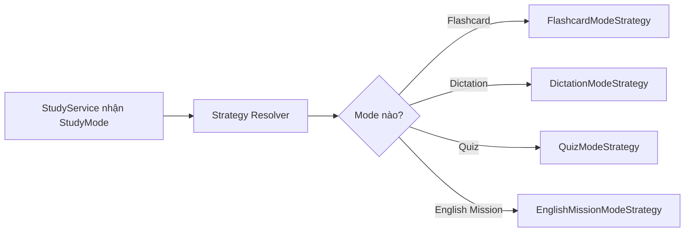

# Strategy, mỗi chế độ học có một cách xử lý riêng

## Chỉ cần nhớ một ý

Strategy đặt mỗi cách xử lý vào một class riêng. Khi chạy, chương trình chọn class phù hợp rồi yêu cầu nó thực hiện công việc.

Trong project này, các chế độ học đều cần trả lời hai câu hỏi:

1. Chế độ này dùng những thẻ nào?
2. Chế độ này hiển thị thế nào trên Study Hub?

Câu trả lời của mỗi chế độ khác nhau. Strategy giúp `StudyService` không phải chứa toàn bộ sự khác nhau đó.

## Ví dụ dễ hiểu

Một học sinh có thể học cùng bộ thẻ theo nhiều cách:

```text
Flashcard       = xem mặt trước rồi lật thẻ
Nghe chép       = nghe âm thanh rồi nhập câu trả lời
Trắc nghiệm     = chọn một đáp án
English Mission = dùng từ trong hội thoại với AI
```

Mỗi cách học có luật riêng. Ví dụ, Nghe chép theo câu cần thẻ có `ExampleSentence`, còn English Mission cần ít nhất 3 thẻ.

## Trước khi áp dụng Strategy, code triển khai ra sao?

Nếu đặt mọi luật trong `StudyService`, code sẽ có nhiều nhánh:

```csharp
if (mode == StudyMode.Flashcard)
{
    // Lấy thẻ cho Flashcard.
}
else if (mode == StudyMode.Dictation)
{
    // Lọc thêm thẻ có câu ví dụ.
}
else if (mode == StudyMode.Quiz)
{
    // Kiểm tra khả năng tạo câu hỏi.
}
```

Phần tạo lựa chọn trên Study Hub cũng cần một nhóm `if` tương tự:

```csharp
if (mode == StudyMode.Flashcard)
{
    name = "Flashcard";
    estimatedSeconds = cardCount * 15;
}
else if (mode == StudyMode.Dictation)
{
    name = "Nghe chép";
    estimatedSeconds = cardCount * 25;
}
```

Cách này chạy được khi chỉ có một hoặc hai chế độ. Khi thêm chế độ mới, lập trình viên phải tìm và sửa mọi nhóm `if`. Luật của một chế độ cũng có thể bị lặp ở Study Hub và trang học thật.

## Vì sao chọn Strategy cho chức năng này?

Chức năng có nhiều cách xử lý cùng một mục tiêu. Tất cả chế độ đều lấy thẻ và tạo thông tin hiển thị, nhưng thuật toán bên trong khác nhau.

Chế độ cần được chọn lúc chương trình đang chạy. Giá trị `StudyMode` cho biết strategy nào phải được dùng.

Các chế độ còn tiếp tục được bổ sung. Tách từng chế độ giúp sửa Nghe chép mà không đụng vào Trắc nghiệm hoặc Flashcard.

Có thể so sánh ngắn gọn:

```text
Trước Strategy:
StudyService biết chi tiết của mọi chế độ.

Sau Strategy:
StudyService chỉ chọn đúng strategy và gọi nó.
```

## Strategy nằm ở đâu trong project?

| Vai trò | Code |
| --- | --- |
| Strategy | [`IStudyModeStrategy`](../Services/StudyModes/IStudyModeStrategy.cs) |
| Concrete Strategy | [`FlashcardModeStrategy`](../Services/StudyModes/FlashcardModeStrategy.cs) |
| Concrete Strategy | [`DictationModeStrategy`](../Services/StudyModes/DictationModeStrategy.cs) |
| Concrete Strategy | [`QuizModeStrategy`](../Services/StudyModes/QuizModeStrategy.cs) |
| Concrete Strategy | [`EnglishMissionModeStrategy`](../Services/StudyModes/EnglishMissionModeStrategy.cs) |
| Context | [`StudyService`](../Services/Study/StudyService.cs) |
| Bộ chọn | [`StudyModeStrategyResolver`](../Services/StudyModes/StudyModeStrategyResolver.cs) |

Interface chung yêu cầu mỗi strategy có cùng hình dạng:

```csharp
public interface IStudyModeStrategy
{
    StudyMode Mode { get; }

    Task<List<Flashcard>> GetCardsAsync(
        int setId,
        UserStudySettings settings,
        string? userId);

    StudyModeOptionViewModel BuildOption(
        int setId,
        IReadOnlyList<Flashcard> cards,
        UserStudySettings settings);
}
```

`StudyService` không cần biết code bên trong từng strategy. Nó chỉ làm như sau:

```csharp
IStudyModeStrategy strategy = _strategyResolver.Resolve(mode);
List<Flashcard> cards = await strategy.GetCardsAsync(setId, settings, userId);
```

## Resolver làm gì?

`StudyModeStrategyResolver` nhận danh sách strategy từ dependency injection.

Khi được yêu cầu chế độ `Dictation`, resolver tìm strategy có:

```csharp
strategy.Mode == StudyMode.Dictation
```

Nó yêu cầu có đúng một kết quả:

- Không có strategy thì cấu hình bị thiếu.
- Có nhiều hơn một strategy cho cùng mode thì cấu hình bị trùng.
- Có đúng một strategy thì trả strategy đó.



## Ví dụ về sự khác nhau giữa các strategy

`FlashcardModeStrategy` lấy các thẻ sau bộ lọc chung và sắp xếp theo `OrderIndex`.

`DictationModeStrategy` làm thêm một bước. Nếu người dùng chọn nghe câu ví dụ, nó loại các thẻ không có `ExampleSentence`.

`QuizModeStrategy` còn hỏi `QuizQuestionFactory` xem dữ liệu hiện tại có đủ để tạo câu hỏi hay không.

`EnglishMissionModeStrategy` chỉ cho phép bắt đầu khi có ít nhất 3 thẻ phù hợp.

Mỗi luật nằm trong class của đúng chế độ.

## Strategy không làm việc gì?

Strategy không điều khiển toàn bộ buổi học. Nó không lưu kết quả, không chấm điểm và không mở huy hiệu.

Trong project này, Strategy chủ yếu chịu trách nhiệm chọn thẻ và tạo lựa chọn trên Study Hub. Các service như `QuizService` và `DictationService` tiếp tục xử lý quy trình học thật.

## Tự kiểm tra

1. Vì sao không đặt tất cả chế độ trong một `switch` lớn?
2. Khi thêm một chế độ học mới, cần tạo phần chính nào?
3. Resolver dùng `StudyMode` để làm gì?

Đáp án:

1. Vì service sẽ biết quá nhiều luật và phải sửa mỗi khi có mode mới.
2. Tạo một class triển khai `IStudyModeStrategy` và đăng ký nó trong DI.
3. Để tìm đúng strategy cho chế độ đang được yêu cầu.

## Kết luận ngắn

Strategy giúp project xem mỗi chế độ học là một cách xử lý có thể thay thế. `StudyService` điều phối, còn từng strategy giữ luật riêng của Flashcard, Nghe chép, Trắc nghiệm hoặc English Mission.
